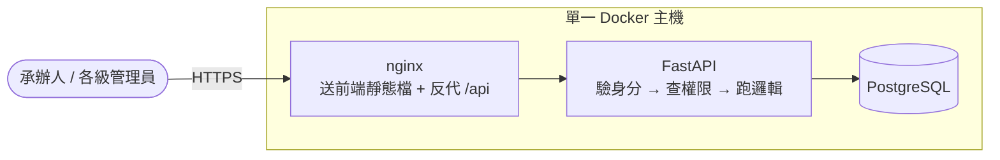
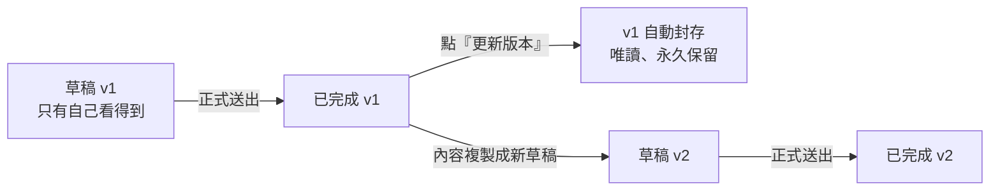

公部門單位要導入一個 AI 應用之前，得先做一次風險評估——這個應用會影響到誰、可能出什麼問題、有沒有對應的措施。我在工作上負責的，就是把這整套流程做成一個系統：承辦人在網頁上一步步填問卷，各級管理員在自己的權責範圍內看填寫進度、管帳號。這就是「AI風險管理措施檢核系統」。

全端的工作我本來就在做，所以前端、後端、資料庫、Docker 一路到部署這條線本身不算是挑戰。這個專案真正花掉我最多時間的是**身分權限控制**——五種角色、各自不同的管轄範圍，而且需求在過程中改了好幾輪。要重新適應這種複雜度、把一次次變動的需求拆解成程式裡守得住的規則，比寫任何一個單一功能都難。

這篇來記錄幾個我覺得比較有意思的設計決定，還有踩過的坑。

## 這件事的源頭：人工智慧基本法

會有這套系統，直接的背景是[人工智慧基本法](https://law.moj.gov.tw/LawClass/LawAll.aspx?pcode=H0160093)。這部法在 2026 年 1 月 14 日公布，而且是公布之日起施行，其中第 19 條寫得很直接：

> 政府使用人工智慧執行業務或提供服務，應進行風險評估，規劃風險因應措施。政府應依使用人工智慧之業務性質，訂定使用規範或內控管理機制。

一句話兩件事：**做風險評估**、**規劃因應措施**。這套系統就是把這兩件事變成一個能操作、能留紀錄的流程——問卷的五個步驟正好對著這個順序走：盤點應用情境 → 識別風險 → 評估風險 → 應對風險 → 綜合判定。

法規裡還有幾條直接影響到系統怎麼設計：

- **第 16 條**要求推動與國際介接的「人工智慧風險分類框架」，各目的事業主管機關再循這個框架訂定以風險為基礎的管理規範。也就是說，問卷的框架與風險判定規則**注定會改版**——這直接決定了後面講到的 JSONB 與框架版本快照。
- **第 5 條**與**第 17 條**都圍繞「高風險應用」：高風險要標示注意事項或警語、要明確責任歸屬與歸責條件。所以問卷的最後一步是「綜合判定」，要明確產出「這個應用是不是高風險」，而不是填完一堆題目就結束。
- **第 4 條**列的七項原則裡有一條是「問責」。這也是為什麼版本控制與稽核日誌從一開始就是核心需求，不是事後補的功能——每一版評估、每一次修改，都要知道是誰、什麼時候、改了什麼。

法規講的是「要做什麼」，系統要解決的是「怎麼做得下去」。這兩者之間的距離，差不多就是這篇文章的內容。

## 系統長什麼樣

整體不複雜，一台機器上跑三個容器：



一句話講完：**承辦人在網頁上一步步填風險評估問卷，後端負責「你是誰、能不能做、資料怎麼存」，最後全部落在資料庫。**

## 技術選型

後端用 **FastAPI** 搭 **SQLAlchemy 2.0**（async）+ asyncpg，資料庫 **PostgreSQL**；前端是 **React 19 + Vite + TypeScript + Tailwind CSS 4**。

選 FastAPI 主要是兩個原因。一是 Pydantic 的型別驗證直接綁在 API 簽章上，非法輸入在進到業務邏輯之前就被擋掉，我不用在每個端點手寫一堆 `if not xxx: return 400`。二是自動生成的 OpenAPI 文件很好用，開發期間前端要對欄位直接開 `/docs` 就好，不用另外維護一份 API 文件。

資料庫選 PostgreSQL 是因為 **JSONB**，這個後面會單獨講。

前端會是 React 而不是我比較熟的 Vue，主要是專案本身的技術決定。不過真的寫下來之後感覺還好，之前寫過一篇[從 Vue 跳到 React 的心得](/posts/vue-to-react-transition/)，這次算是把那些觀念拿來實戰了一輪。

部署刻意保持樸素——單機 Docker Compose 三個容器，沒有 k8s、沒有雲服務。公部門的環境不能假設對方有什麼基礎設施可以用，越少相依越好，這點後面講部署的時候會更有感。

## 最花時間的其實是權限

系統有五種角色：系統管理員、平台觀察員（唯讀）、部會管理員、機關管理員、一般使用者（承辦人）。

一開始的設計是「逐帳號給旗標」——每個帳號上掛可新增、可修改、可刪除三個開關，管理員自己勾。做到一半就發現這樣完全管不動：每次有人問「為什麼他能刪我不能刪」，都要去翻那個帳號的旗標組合，而且旗標之間的組合會生出一堆現實中不存在的權限狀態。

後來整個收斂成兩個維度：**角色決定「能做什麼」，範圍決定「對誰能做」。**

<div class="table-wrapper" tabindex="0" role="group" aria-label="表格（可水平捲動）">

| 角色       | 管轄範圍         | 對問卷                   |
| ---------- | ---------------- | ------------------------ |
| 系統管理員 | 全平台           | 建立、查閱、刪除整份情境 |
| 平台觀察員 | 全平台           | 只能看（含草稿）         |
| 部會管理員 | 本部會＋下屬機關 | 建立、查閱、刪草稿       |
| 機關管理員 | 本機關           | 建立、查閱、刪草稿       |
| 一般使用者 | 個人             | 建立並修改自己的問卷     |

</div>

實作上分成兩道關卡。第一道在 FastAPI 的依賴注入層，只管「這個端點接受哪些角色」，集中在一張表裡：

```python
# auth.py — 「哪一類端點接受哪些角色」的單一真實來源
ROLE_GROUPS: dict[str, tuple[UserRole, ...]] = {
    "ADMIN_ONLY": (UserRole.System_Admin,),
    "ADMIN_OR_DEPT": (
        UserRole.System_Admin,
        UserRole.Dept_Admin,
        UserRole.Agency_Admin,
    ),
    "ANY_ADMIN": (  # 跨範圍「查看」端點，含唯讀的平台觀察員
        UserRole.System_Admin,
        UserRole.Platform_Observer,
        UserRole.Dept_Admin,
        UserRole.Agency_Admin,
    ),
}

# 預建守衛，router 直接當 Depends 用，不各自重寫一份角色清單
AdminOnly = Depends(require_roles(*ROLE_GROUPS["ADMIN_ONLY"]))
AdminOrDeptAdmin = Depends(require_roles(*ROLE_GROUPS["ADMIN_OR_DEPT"]))
```

這樣做的好處是新增一種角色、或調整某個群組的成員，只要改這張表，所有端點自動跟著變。之前散在各個 router 裡各寫一份的時候，改一次要 grep 全專案，很容易漏。

第二道關卡在 service 層，判斷「這個人能不能對**這一筆**資料做這件事」——因為光看角色不夠，還要比對資料的歸屬：

```python
if user.role == UserRole.General_User:
    if action == Action.READ:
        # 自己的，或「同機關」已提交的問卷（別人的草稿一律看不到）
        return project_creator_id == user.user_id or (
            user.agency_id is not None
            and project_agency_id == user.agency_id
            and project_status == "completed"
        )
    # 寫入：只能動自己的草稿
    return project_creator_id == user.user_id and project_status == "draft"
```

router 薄、service 厚，權限判斷全部集中在這兩個地方，是我後來覺得最值得的一個決定。

### 降權要即時生效

這個問題是中期才想到的。JWT 是無狀態的，token 裡面存的角色、部會、機關都是**登入當下的快照**。所以如果管理員把某個人從部會管理員降成一般使用者，在 access token 過期之前（我設 60 分鐘），這個人手上那張通行證還是寫著舊角色。

聽起來只是「延遲一小時生效」，但實際上更嚴重：被降權的人在這一小時內還能用舊權限去新增一個管理員帳號，那就等於留了一個永久後門。

解法是在「每個請求都一定會經過」的那個關卡回查資料庫，用現值覆蓋 token 裡的快照：

```python
async def get_current_active_user(user=Depends(get_current_user), db=Depends(get_db)):
    """回查 is_active 與權限敏感欄位（role / dept_id / agency_id），以 DB 現值為準。"""
    row = (
        await db.execute(
            select(User.role, User.dept_id, User.agency_id)
            .where(User.user_id == user.user_id)
            .where(User.is_active == True)
        )
    ).one_or_none()
    if row is None:
        raise HTTPException(status_code=401, detail="帳號不存在或已停用")
    return CurrentUser(
        user_id=user.user_id,
        role=row.role,
        dept_id=row.dept_id,
        agency_id=row.agency_id,
    )
```

原本這裡只查 `is_active`（停用要即時生效），多查三個欄位是同一次查詢，不多一次往返，成本幾乎是零。這段程式碼我特別在註解裡寫清楚它為什麼存在——不然看起來就像「明明 token 裡有了還去查一次」的多餘程式碼，很容易被後人順手刪掉。

## 一份問卷要留下完整歷史

這是需求裡明確要求的：已經送出的評估之後可以更新，但**每一版都要留著**，而且要知道當初為什麼改。

狀態設計成三種：



實作上不是「開一張版本歷史表」，而是同一張表裡用兩個欄位串成鏈：`root_project_id` 指向整條鏈的源頭、`parent_id` 指向前一版。這樣所有版本共用同一組欄位與同一套權限判斷，不用維護兩份 schema。

不過鏈式結構有個不變式要守住：**同一條鏈裡的 `version_no` 不能重複**。如果兩個人同時對同一份問卷點「更新版本」，兩邊都先查到「目前最新是 v1」，然後都寫入 v2，鏈就髒了。這是典型的 check-then-act 競態，光靠應用層先查再寫擋不住，所以在資料庫加了一道後盾：

```python
# 鏈鍵＝COALESCE(root_project_id, project_id)：同一條鏈內，未刪除的 version_no 不得重複
Index(
    "uq_pel_chain_version",
    text("COALESCE(root_project_id, project_id)"),
    "version_no",
    unique=True,
    postgresql_where=text("deleted_at IS NULL"),
)
```

PostgreSQL 的**部分索引**（partial index）在這裡剛好合用——只對「還沒被刪除」的資料列強制唯一，垃圾桶裡的舊資料不會誤擋。並發時第二個寫入者會在 commit 撞上這個唯一索引而失敗，比自己在應用層寫鎖可靠得多。

另外還做了兩個補救功能，都是同事實際用過之後回報的需求：改到一半可以「放棄改版」回到原本已完成的版本；剛送出的新版也可以「還原上一版」。後者刻意限制成只能還原**緊鄰目前版本的前一版**——它的用途是救「手殘按太快」，不是讓人隨意跳回任意舊版本。這條限制前端和 service 層各擋一次，避免有人直接打 API 繞過。

## 問卷題目一直在變，所以用 JSONB

專案初期最頭痛的是題目還沒定稿。五個步驟裡每一步都有一堆欄位，而且會議開完就可能增減。這不是這個專案特別混亂，而是前面第 16 條那件事的必然結果——風險分類框架本身還在成形，依它訂出來的問卷當然也會跟著動。如果每個欄位都對應一個資料庫欄位，那每次改題目都要寫一支 migration，光是這件事就會把時間吃光。

所以五個步驟的作答內容各存成一個 **JSONB** 欄位：

```python
current_step: Mapped[int]
step1_scope: Mapped[Optional[Dict[str, Any]]] = mapped_column(JSONB)  # 盤點應用情境
step2_impact: Mapped[Optional[Dict[str, Any]]] = mapped_column(JSONB)  # 識別風險
step3_mitigation: Mapped[Optional[Dict[str, Any]]] = mapped_column(JSONB)  # 評估風險
step4_response: Mapped[Optional[Dict[str, Any]]] = mapped_column(JSONB)  # 應對風險
step5_decision: Mapped[Optional[Dict[str, Any]]] = mapped_column(JSONB)  # 綜合判定

# 五步驟進度 {"1":"none|draft|done", ...}：支撐畫面上的灰圈／藍圈／綠勾
step_status: Mapped[Optional[Dict[str, Any]]] = mapped_column(JSONB)
```

題目調整時只要改前端的題目設定檔，資料庫完全不用動。實際上題目後來確實改了好幾輪，這個決定省下的時間非常可觀。

但 JSONB 不是免費的，代價是**資料庫不再幫你驗證形狀**。原本靠 `VARCHAR(700)` 就能擋掉的事情，現在都得自己來。這邊踩過一個坑蠻有代表性：

需求有一條「單一文字欄位不可超過 700 字」，我一開始就照字面實作，遞迴走過 JSON 的每個字串值去檢查長度。結果步驟四的「應對措施」是可以動態新增多筆的，前端把整個陣列 `JSON.stringify` 成一個字串塞進去，於是「五筆各 200 字的措施」加起來變成一個 1000 字的字串，直接誤觸上限。

修法是遇到「本身是合法 JSON 陣列／物件」的字串就遞迴進去，檢查它裡面的每個文字子欄位，而不是量整段序列化字串的總長度：

```python
def _walk_text_limit(o: Any) -> None:
    if isinstance(o, str):
        try:
            parsed = json.loads(o)
        except (ValueError, TypeError):
            parsed = None
        # 字串本身是 JSON 陣列／物件（動態多筆欄位）→ 遞迴檢查內部各筆
        if isinstance(parsed, (list, dict)):
            _walk_text_limit(parsed)
            return
        if len(o) > _TEXT_LIMIT:
            raise HTTPException(400, f"單一欄位文字不可超過 {_TEXT_LIMIT} 字")
    elif isinstance(o, dict):
        for v in o.values():
            _walk_text_limit(v)
    elif isinstance(o, list):
        for v in o:
            _walk_text_limit(v)
```

這個坑的本質是：限制的本意是「單一文字框」，但實作時量到的是「整份序列化資料」。用 JSONB 換來彈性，就得自己補上這類語意層的驗證。

另外，題目會改就衍生另一個問題：舊紀錄怎麼辦？做法是每一版問卷框架存一份完整快照，每筆問卷記錄「填寫當下是哪一版框架」，這樣框架改版之後回頭看舊紀錄，還是會依當時的題目正確呈現。

## 資料不能變孤兒

這套系統的資料歸屬鏈是「部會 → 機關 → 使用者 → 問卷」，所有外鍵都設 `RESTRICT`：某個承辦人名下還有問卷，就不能直接刪這個帳號，得先把問卷轉移給別人。這是刻意的，稽核情境下不能讓資料悄悄失去歸屬。

但這條規則跟「垃圾桶」功能撞得很硬。已送出的整份情境刪除時走軟刪除，進垃圾桶保留 7 天可救回。問題是：只要垃圾桶裡還躺著這筆情境，它的原擁有者帳號、所屬部會與機關就**永遠刪不掉**——外鍵一直被 `RESTRICT` 擋著。

解法是軟刪除的同時把三個歸屬欄位「脫鉤」設成 NULL，原歸屬只留在稽核日誌裡；救回的時候由系統管理員重新指定部會、機關與承辦人。這裡刻意**不**用 `ondelete=SET NULL`，因為那會讓「有效的情境」也可能被悄悄孤兒化——脫鉤必須是「刪除情境」這個明確動作的一部分，不能是「刪除帳號」的副作用。

然後就踩到這個專案裡我最印象深刻的坑。資料庫上有一個 trigger，掛在 `UPDATE OF dept_id, created_by`，用來確保「建立者必須屬於這筆情境的部會」：

```sql
-- 建立者不屬於該部會就直接擋下（系統管理員無所屬部會，例外放行）
IF creator_dept IS DISTINCT FROM NEW.dept_id THEN
    RAISE EXCEPTION 'PERMISSION_DENIED: 使用者 % 不屬於部會 %',
        NEW.created_by, NEW.dept_id;
END IF;
```

我原本很自然地分兩句寫：先清 `dept_id`，再清 `created_by`。結果第一句就爆掉——那一瞬間 `created_by` 還在，trigger 抓到「這個建立者的部會不是 NULL」，直接 RAISE。

必須讓兩個欄位在**同一句 UPDATE** 裡一起設 NULL：

```python
# ⚠ created_by 與 dept_id 必須在同一句 UPDATE 內一起設 NULL，
#   分兩句寫會被 trigger 抓到中間的不一致狀態而擋下（實測驗證過）
await db.execute(
    update(ProjectEvaluationLog)
    .where(cond)
    .values(
        deleted_at=datetime.now(timezone.utc),
        created_by=None,
        dept_id=None,
        agency_id=None,
    )
)
```

把資料完整性約束下推到資料庫層，好處是應用層有 bug 也擋得住；代價就是你得順著它的檢查時機寫程式，這種「中間狀態」的坑光看程式碼看不出來，只有實際跑到才會知道。

還有一個相關的小問題：垃圾桶的 7 天保留期，原本是「系統管理員打開刪除程序頁面時順手清一次」。也就是說，保留政策實際上完全仰賴管理員恰好造訪那個頁面——如果一個月沒人打開，逾期資料就一個月不會被清掉。後來改成應用啟動時就掛一個常駐的背景迴圈，每 6 小時主動清一次，順路把過期的密碼設定 token 一起清掉。這種「該定期發生的事情，別綁在人為操作上」的教訓蠻通用的。

## 上線前的資安補強

公部門專案上線前要過資安弱點掃描與無障礙檢測，這段時間集中補了不少東西，挑幾個有代表性的講。

**Token 存哪裡。** 一開始 access 和 refresh token 都存 localStorage，這是最方便但也最脆弱的做法——任何一處 XSS 都能把兩張票整組讀走，而 refresh token 效期有 7 天，等於帳號被接管一週。後來改成：refresh token 走 `httpOnly` + `SameSite=Strict` cookie，JS 完全讀不到；access token 只放記憶體變數，重新整理頁面就消失，靠 cookie 在 App 啟動時換發新的。

```ts
// access token 只放記憶體變數，不進 localStorage
let accessToken: string | null = null;

// refresh token 是 httpOnly cookie，JS 讀不到，靠 credentials: "include" 自動附帶
async function performRefresh(): Promise<string | null> {
  const res = await fetch(`${BASE_URL}/auth/refresh`, {
    method: "POST",
    credentials: "include",
  });
  if (!res.ok) return null;
  const data = (await res.json()) as { access_token: string };
  setAccessToken(data.access_token);
  return data.access_token;
}
```

代價是「重新整理會閃一下才恢復登入狀態」，但換來的是「即使有 XSS，也拿不到可以離線重放的長效 token」，這個交換很值得。

順帶要處理的是並發：頁面同時發五個請求、五個一起收到 401，不能各自去刷新一次。做法是單一刷新加一個等待佇列，第一個請求去換 token，其他的排隊等結果，拿到之後各自重試一次。

**限流的計數 key。** 登入、忘記密碼、重設密碼這幾個未登入就能打的端點都要限流，我原本用 IP 當 key。後來想到一個問題：同一個機關的使用者很可能共用一個 NAT 出口 IP，如果有人在那邊狂試登入，會連帶把同事的「忘記密碼」功能一起鎖掉。這三條路徑代表的是不同的濫用手法（帳密猜測／寄信轟炸／token 猜測），共用一份配額只會製造誤傷，所以改成 `(ip, path)` 分開計數：

```python
_login_attempts: dict[tuple[str, str], list[float]] = {}  # (ip, path) → [timestamp, ...]
```

**信件連結不能直接信 Host 標頭。** 邀請信與忘記密碼信裡的連結網址，是依實際請求動態組出來的。但「忘記密碼」是未登入就能觸發的公開端點，而 Host 標頭是訪客可以完全操控的輸入——照單全收的話，別人就能讓系統寄出一封連結指向釣魚網域的信。後來改成只有在設定了明確的網域白名單時才信任這個標頭，而且白名單設定值打錯（解析出空集合）時要 fail-closed，絕對不能靜默退回「不設限」。

**啟動時就 fail-fast。** `JWT_SECRET` 如果還是 `.env.example` 裡的佔位字串，後端直接拒絕啟動而不是印個警告繼續跑。HS256 之下這把密鑰等於可以偽造任意身分的 token，這種東西沒有「先上線再說」的空間。

**富文本雙層淨化。** FAQ 有個富文本編輯器，前端用 DOMPurify、後端用 nh3 各過一次白名單。前端那層是為了體驗（貼進來的東西馬上就乾淨），後端那層才是真正的防線——因為前端的檢查繞過只需要一個 curl。

## 部署踩的坑

這部分是我原本最沒經驗、結果學到最多的一段。

正式環境是**離線的**（air-gapped），連 Docker 本身都要離線安裝。所以映像不能在目標機上 build，得在自己電腦 build 好、`docker save` 成 tar、傳過去 `docker load`。

這裡有一條鐵律是踩過才知道的：**離線環境絕對不能 `docker compose up --build`。** 目標機上放的是上一版的原始碼樹，一 `--build` 就會拿舊碼重新編一份映像蓋回去，服務起得來、看起來一切正常，但跑的是舊程式。這種「靜默跑舊碼」的失敗特別難查，因為沒有任何錯誤訊息。改版一律是**換映像，不換原始碼樹**。

另一個更有意思的問題是 504。正式環境的架構是 App 和資料庫**分在兩台主機**，跨網路要過防火牆。上線之後偶發性地出現使用者操作到一半就 504，而且重試一次通常就好了。

查下來的原因是：連線池裡的連線閒置一段時間後，被中間的網路設備靜默清掉了連線狀態，兩端都沒收到 FIN 或 RST。連線池不知道這條連線已經死了，還是把它交給下一個請求，query 送出去沒人回應，一路卡到 TCP 重傳耗盡（Linux 預設十幾分鐘），遠遠超過 nginx 的 60 秒 `proxy_read_timeout`，於是使用者看到 504。

解法只有兩行：

```python
engine = create_async_engine(
    settings.database_url,
    pool_pre_ping=True,  # 交出連線前先探活，死的直接丟棄重開（LAN 內成本 < 1ms）
    pool_recycle=1800,  # 存活滿 30 分鐘就回收，不讓它閒置到被防火牆砍掉
)
```

`pool_pre_ping` 是治本的那一行——交出連線之前先送一個探測，死的就丟掉重開。`pool_recycle` 是預防性的，不讓連線閒置到被砍。單機部署（資料庫在同一台的 Docker 網路內）本來就不會遇到這個問題，所以在測試環境完全重現不出來，這也是它難查的原因。

寫過一篇[講 Timeout、Retry 與 Circuit Breaker 的文章](/posts/api-resilience-patterns/)，當時是從前端打 API 的角度談，這次是在後端連資料庫的層次遇到同一類問題——連線不會告訴你它死了，你得自己去確認。

## 通知信與統計

系統會每天寄一封摘要信給系統管理員與平台觀察員，內容是整體 KPI、情境狀態分布、各單位填寫狀況。這個功能有兩個地方比我預期的麻煩。

**排程不要算「下次發送的秒數」。** 直覺做法是算出距離下次發送時間還有幾秒，然後 sleep 到那個時刻。但這樣管理員中途改了發送時間會完全沒反應——程式還睡在上一次算好的那個時間點。改成每 5 分鐘輪詢一次，判斷「現在過了今天的發送時刻嗎、今天是排定發送日嗎、今天已經跑過了嗎」。最後那個判斷一律查資料庫的執行記錄，而不是靠行程的記憶體狀態，這樣容器重啟既不會漏寄也不會重複寄。

**統計區間要接力，不能算「當日 00:00 起」。** 信件裡有「本期新增了幾份情境」這類增量數字。如果區間固定從當日 00:00 算到發送時刻，那「發送時刻到隔天凌晨」這十幾個小時的資料每天都會被漏掉，而且是永久漏掉、沒有任何一封信會涵蓋到。改成接力式：起點是上一封**實際寄出**的信的時刻、終點是本次寄送時刻，半開區間，自動跨過週末和停發日。這也是為什麼信裡的用詞是「本期」而不是「今日」。

還有一個純粹是知識問題：**Outlook 桌面版是用 Word 的排版引擎在渲染 HTML 信件。** flex、grid、`max-width`、CSS 變數全都不支援。信件樣板全部改回 `<table>` 排版，`cellpadding`、`cellspacing` 寫成 HTML 屬性而不是 CSS。這件事沒辦法用一般網頁 CSS 的經驗類推，只能查 caniemail.com。

## 測試怎麼分層

這個專案的測試分三層，各有各的目的：

**純函式與權限矩陣的單元測試。** 用假資料，不碰資料庫，跑得很快。權限那張「五角色 × 四動作 × 各種歸屬組合」的矩陣就是這樣一格一格斷言的，是整套測試裡最有價值的一塊——權限邏輯改動的時候，這批測試是唯一能讓我放心的東西。

**走真實 PostgreSQL 的整合測試。** 用 testcontainers 起一個真的資料庫容器。JSONB、部分唯一索引、trigger 這些行為只有真實資料庫才驗得出來，SQLite 之類的替代品完全模擬不了。環境沒有 Docker 時整批自動 skip，而不是變成一片紅燈。

**端到端的端點測試。** 用 `httpx.AsyncClient` + `ASGITransport` 直接打完整的 ASGI app，不用真的起一個 server。每個端點的權限分支都走一遍，確認該 403 的真的 403。

三層加起來三千多行測試。老實說寫的時候有點煩，但改權限邏輯或動版本鏈的時候，這批測試救過我好幾次。

## 學到什麼

**先想清楚不變式，再想功能。** 「同一條鏈的版本號不重複」、「有效的情境一定有歸屬」、「建立者必須屬於該部會」，這幾條想清楚之後，後面的功能只是在不違反它們的前提下組合出來。反過來先做功能再補約束，就會一直在補洞。

**約束下推到資料庫，但要知道代價。** trigger 和唯一索引擋掉了應用層可能出錯的地方，這是好事。但它們的檢查時機會反過來限制你怎麼寫程式——像那個「必須在同一句 UPDATE 裡設 NULL」的坑，光讀 Python 程式碼永遠看不出來。

**替後人留下「為什麼」而不只是「做了什麼」。** 這個專案我在程式碼裡寫了不少「這段為什麼存在」的註解，特別是那些看起來多餘的部分——每個請求都回查資料庫、連線池的兩個參數、刻意保留但不顯示的規則評估。做了什麼看程式碼就知道，為什麼這樣做只有當下那個人知道，不寫下來就沒了。

**需求會變，所以要抓「不會變的那層」。** 這個專案的權限需求改了好幾輪，每次改動聽起來都只是「某個角色多／少一件事」。一開始我是照著需求一條條改程式，改到第三輪就發現這樣不行——同一件事散在好幾個 router 裡，改一次就要 grep 全專案。後來把「角色 × 範圍」這兩個維度抽出來當骨架，需求變動就變成改一張表或改一個判斷式，這才真的跟得上。技術棧再熟，也不會自動幫你把需求拆對。

## 結語

這個專案還在往正式上線推進，維運層面還有一些事情要收尾。但整體回頭看，最花時間的不是寫功能，而是把「規則到底是什麼」想清楚——五種角色能做什麼、版本怎麼算一版、資料能不能沒有歸屬。法規只告訴你「政府使用 AI 應進行風險評估」，剩下那些細節得自己一條條問出來、談出來，再變成程式裡守得住的規則。這些想通之後，程式碼反而是最直接的那一段。

---

站內相關文章：

- [Nuxt 3 JWT 身份驗證實作筆記](/posts/nuxt3-jwt-pinia-auth/)
- [從 Vue 跳到 React 的開發心得](/posts/vue-to-react-transition/)
- [API 請求卡住怎麼辦？聊聊 Timeout、Retry 與 Circuit Breaker](/posts/api-resilience-patterns/)
- [前端測試實戰 — 為什麼你需要寫測試？](/posts/frontend-testing-vitest-guide/)
