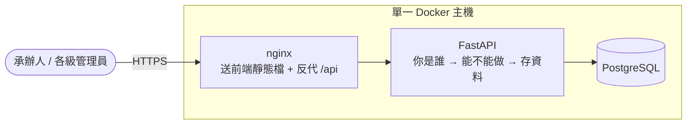

一個公部門單位想導入 AI 來幫忙處理業務，開始用之前得先回答一串問題：這東西會用在哪、可能影響到誰、出事了誰負責、有沒有先想好對策。我的工作就是把這一串問題做成系統——承辦人在網頁上一步步填問卷，各級管理員在自己的權責範圍內看進度、管帳號。

全端這條線本身不算挑戰。真正吃掉時間的是**身分權限控制**，還有幾個只有實際跑起來才會現形的坑。這篇挑那幾段來寫。

## 這件事的源頭

系統不是誰突發奇想想做的。[人工智慧基本法](https://law.moj.gov.tw/LawClass/LawAll.aspx?pcode=H0160093)在 2026 年 1 月 14 日公布並自公布之日起施行，第 19 條要求政府使用人工智慧執行業務或提供服務應進行風險評估、規劃風險因應措施——問卷的五個步驟就是照這個順序走：盤點應用情境 → 識別風險 → 評估風險 → 應對風險 → 綜合判定。

另外兩條直接決定了系統長什麼樣。第 16 條要求循一套與國際介接的「人工智慧風險分類框架」訂定管理規範，翻成白話就是問卷題目注定會改版，而且不只改一次（後面 JSONB 那段的起因）；第 4 條列的七項原則裡有一條「問責」，所以版本控制與稽核日誌從第一天就是核心需求，不是事後補的功能。

## 系統長什麼樣

預設就是一台機器上跑三個容器：



後端是 **FastAPI** + SQLAlchemy 2.0（async）+ asyncpg，資料庫 **PostgreSQL**，前端是 **React 19 + Vite + TypeScript + Tailwind CSS 4**。選 FastAPI 是因為 Pydantic 把型別驗證綁在 API 的函式簽章上，格式不對的輸入在進到業務邏輯之前就被擋掉，不用在每個端點手寫一堆 `if not xxx: return 400`；選 PostgreSQL 是因為 JSONB，後面單獨講。JWT 用 PyJWT 而不是很多教學文裡的 python-jose，因為後者有一個「把演算法宣告成 none 就能繞過驗證」的漏洞，而且已經沒有修復版本了。前端用 React 而不是我比較熟的 Vue 是專案本身的技術決定，之前寫過一篇[從 Vue 跳到 React 的心得](/posts/vue-to-react-transition/)，這次算是拿來實戰了一輪。

對外只有 nginx 這一個容器開埠，FastAPI 和資料庫都只在內部網路互通，nginx 用的還是非 root 執行的映像。部署刻意保持樸素：單機 Docker Compose，沒有 k8s、沒有雲服務——公部門的環境不能假設對方有什麼基礎設施可以用。

上面這張圖是測試站的樣子。正式機把資料庫另外拉到一台主機，那條線後來就出事了，最後會講。

## 「為什麼他可以刪，我不行？」

專案中期有一天，同事跑來問我這句話。我打開後台去翻那個人的帳號設定，翻了兩三分鐘還是答不出一句話能講完的理由。那一刻我就知道權限設計壞掉了。

當時的做法是「逐帳號給旗標」——每個帳號上掛可新增、可修改、可刪除三個勾勾，管理員自己勾。聽起來很彈性，實際上權限散在每個帳號身上，沒有人說得出「這一類的人應該長怎樣」；而且三個勾勾能組出八種狀態，其中好幾種在現實裡根本不存在——「能刪但不能改」是什麼職位？

後來整個收斂成兩個維度：**角色決定「能做什麼」，範圍決定「對誰能做」。** 那三個逐帳號的勾勾直接從資料表移除，能不能寫一律由角色身分決定。

<div class="table-wrapper" tabindex="0" role="group" aria-label="表格（可水平捲動）">

| 角色                 | 管得到誰的資料                               | 對問卷能做什麼                                   |
| -------------------- | -------------------------------------------- | ------------------------------------------------ |
| 系統管理員           | 全平台                                       | 建立、查閱、改草稿、刪除整份情境                 |
| 平台觀察員           | 全平台                                       | 只能看，連別人的草稿都看得到，但改不了           |
| 部會管理員           | 本部會＋下屬機關                             | 建立、查閱、改草稿（範圍內不限本人所建）、刪草稿 |
| 機關管理員           | 本機關                                       | 建立、查閱、改草稿（範圍內不限本人所建）、刪草稿 |
| 一般使用者（承辦人） | 自己的，加上同機關同事**已送出**的（只能看） | 建立、修改、刪除自己的草稿                       |

</div>

有一條規矩對所有角色都一樣：**只有草稿能改**，已經正式送出的版本一律唯讀，要動它只能開新的一版。平台觀察員那一列要補一個例外，不然就變成講錯了：他在**問卷**上一份都改不了，但常見問答（FAQ）那一區他可以維護，那是全系統唯一他寫得進去的地方。

部會管理員和機關管理員在問卷上能做的事其實一模一樣，差別只在管得到誰——這是把兩個維度拆開之後才看得清楚的事。

實作上分成兩道關卡。**第一關只問「你是誰」**：FastAPI 可以在每個端點掛一個守衛，先看你的角色在不在這個端點的放行名單裡，不在就直接 403，端點裡的程式碼一行都不會跑到。名單我沒讓它散在各個 router，而是集中成一張表（目前六組角色群組，例如「只有系統管理員」、「三種管理員都行」、「跨範圍查看類，連唯讀的平台觀察員也放行」），需要限定角色的 API 就指向表上的某一組；只要登入就能打的端點則不掛角色群組，範圍留給第二關去比對。

**第二關才問「這筆資料是不是你的」**：兩個一般使用者角色一樣，但各自只能碰自己的東西。以一般使用者的讀取為例——這份是不是我自己建的？如果不是，那它是不是同機關同事的、而且已經正式送出？兩個都不成立就拒絕。所以同事還在寫的草稿我看不到，同事更版之後被封存的舊版我也看不到。寫入更嚴格：必須是自己建的，而且還停在草稿狀態。

這裡刻意收斂成「同機關」而不是「同部會」，是為了讓層級不打架：機關管理員看得到的範圍，一定要大於等於他底下的一般使用者。

老實說還有沒收乾淨的地方：清單和匯出這種「一次撈很多筆」的端點，範圍過濾是直接寫在查詢條件裡的，等於同一條規則有兩份實作，改權限的時候要記得兩邊一起動。

### 降權要即時生效

另一個畫面：某個人被從部會管理員降成一般使用者，管理員在後台改完、按下儲存，然後關掉視窗，以為結束了。其實沒有。

登入成功的時候，系統會發給你一張蓋了章的通行證，上面印著你是誰、什麼角色、屬於哪個部會與機關——這就是 **JWT**，之後每次操作出示這張證，後端驗章就放行。問題是上面印的字是**登入那一刻**的快照。降權之後那張證還是印著舊角色，一路有效到過期為止（程式碼裡的預設值是 60 分鐘，這次部署實際設成 120 分鐘）。

聽起來只是延遲一兩個小時生效，但被降權的人在這段空窗裡，還能用舊權限去新增一個管理員帳號——那就等於留了一個永久後門。空窗多長不是重點，重點是有空窗。

那把證撕掉不就好了？撕不掉。這套系統發出去的 access token 上沒有編號、也沒有版本欄位，伺服器手上沒有一份「已作廢清單」可以比對。所以我要解的不是「把證收回」，而是「別再照證上印的職稱辦事」：在每個需要登入的請求都一定會經過的那道關卡上，回頭去資料庫撈這個人**現在**的角色與歸屬，覆蓋掉證上的快照，查不到（帳號被停用或刪掉）就 401。這個查詢原本就存在（本來就要確認帳號有沒有被停用），多帶三個欄位是同一趟往返，成本幾乎是零。證還是撕不掉，只是證上印的職稱已經不算數了。

## 兩個人同時按下「更新版本」

需求寫得很明確：已經送出的評估之後可以更新，但每一版都要留著，而且要知道當初為什麼改——不然稽核的人來問「原本那版寫什麼」就答不出來，前面第 4 條的問責就沒達成。

想像檔案櫃裡的一疊公文：同一件案子改了三次，就有三份紙訂在一起，每一份右上角都寫著兩個編號——這一疊的第一份是哪一份、我的上一份是哪一份。實作上我沒有另外開一張版本歷史表，就是在原本那張表裡多兩個欄位（`root_project_id` 指向整條鏈的源頭、`parent_id` 指向前一版），同一份問卷的每一版都是同一張表裡的一列，共用同一組欄位、同一套權限判斷。點下「更新版本」的時候，舊版自動封存成唯讀，內容複製成一份新草稿。

然後畫面來了：兩個管理員同時對同一份問卷點下「更新版本」。兩邊的程式都先去查「目前最新是第幾版」，都查到第 1 版，於是都準備寫入第 2 版。從「查完」到「寫入」中間那一小段時間裡，誰也不知道對方也在做同一件事——這種先查再寫、中間被插隊的狀況叫 **check-then-act 競態**，而且光靠應用層「先查再寫」擋不住，因為問題正好發生在「查」跟「寫」的中間。

所以最後一道防線交給資料庫自己守：

```python
# 同一條版本鏈裡，「還沒被刪掉」的版本號不准重複。
# 為什麼要 COALESCE：第一版自己就是鏈的源頭，root 欄位是空的，得退回用自己的 id 當鏈鍵。
# 為什麼限定 deleted_at IS NULL：垃圾桶裡躺著的舊資料不該誤擋新版本。
Index("uq_pel_chain_version", text("COALESCE(root_project_id, project_id)"), "version_no",
      unique=True, postgresql_where=text("deleted_at IS NULL"))
```

最後那行 `postgresql_where` 是整段的關鍵，不是細節。一般的唯一規則是「這張表裡全部都不准重複」，加了條件之後變成「只有符合這個條件的不准重複，其他的我不管」——這在 PostgreSQL 叫**部分索引**（partial index）。搶輸的那一邊會在存檔的那一刻失敗，後端有一個統一的處理器把這類資料庫完整性錯誤轉成 400，而不是讓它變成 500。重點是**我沒有在應用層自己排隊、自己上鎖**，而是把這條規則交給資料庫，讓它在每次寫入時自己檢查。

（另外有「放棄改版」和「還原上一版」兩個補救動作，它們會真的丟掉東西，所以都有稽核日誌留底。「還原上一版」限管理員，而且只能還原緊鄰目前版本的前一版——它是拿來救「手殘按太快」的，不是讓人跳回任意舊版本。常態的更版一律封存保留，一份都不會少。）

## 五筆兩百字，卻說我超過 700 字

專案初期最頭痛的不是技術，是題目還沒定稿——五個步驟每一步都有一堆欄位，開完一次會就可能增減，而前面第 16 條又保證了它會一改再改。如果每個題目都對應一個資料庫欄位，那每改一次題目就要寫一支去改資料表結構的腳本（migration）、排一次上線，光這件事就會把時間吃光。

所以我改成：五個步驟的作答內容各自打包成一整包資料，整包塞進同一格。這種「一格裝一包」的欄位型別叫 **JSONB**，是 PostgreSQL 的東西，可以直接查詢、也能建索引。題目怎麼加、怎麼減都不用動資料表的欄位定義，題目後來確實改了好幾輪，這個決定省下的時間非常可觀。

但 JSONB 不是免費的，代價是**資料庫不再幫你驗證形狀**。原本靠 `VARCHAR(700)` 就能擋掉的事，現在全部得自己來。

需求有一條「單一文字欄位不可超過 700 字」，我照字面實作：走過整包 JSON 的每一個文字值，量長度、超過就擋。結果有人回報：他在步驟四填了五筆應對措施，每筆兩百字，每一筆都遠遠沒到 700 字，但按下送出就被擋，說他超過 700 字。

原因是步驟四的「應對措施」可以動態新增多筆，前端把那五筆打包（`JSON.stringify`）成一整串文字，存進同一格。所以我量到的不是「使用者填的那一個文字框」，而是「五筆打包起來的那一整串」——加起來一千多字，當然爆。修法是在量長度之前先看一眼：這一格文字本身，是不是一包被序列化的資料？是的話就拆開來、一筆一筆量裡面的每個文字子欄位。上限沒有調大，欄位型別也沒有改，改的只是「量誰」。

資料庫只知道那一格是一包 JSON，它不會知道那包裡面哪一段對應到使用者眼中的一個框。用 JSONB 換來彈性，這一類語意層的驗證就得自己補。

題目改了，半年前填過那題的人打開紀錄會不會少一塊？做法是每次改題目就把整份題目卡一份完整快照存下來，每一筆問卷身上都記著自己當初依據的是哪一份；日後打開舊紀錄，系統發現版本不一樣，就去把當年那份題目撈出來照原本的樣子長出來（全表同一時間只能有一版是啟用中的）。所以前面那句「不用動資料庫」要收窄一點講才準確：**資料表的欄位定義不用動、不用寫遷移，但框架改版時要在框架版本表裡發布一版新的題目快照。**

## 離職的帳號刪不掉

某個承辦人離職了，人事要求把帳號刪掉。你按下刪除，系統說不行。

這是刻意的。這套系統的資料歸屬是「部會 → 機關 → 使用者 → 問卷」一路掛下來，而跟歸屬有關的那五條外鍵——使用者掛在哪個部會、哪個機關，問卷掛在哪個承辦人、哪個部會、哪個機關——我都設成 `RESTRICT`：只要還有東西掛在你身上就不准刪你，得先把問卷轉移給別人。稽核情境下，不能讓資料悄悄失去歸屬。

但這條規則跟「垃圾桶」撞得很硬。已送出的整份情境刪除時走的是軟刪除，資料還在、只是被標記成已刪，保留 7 天可以救回。問題是垃圾桶裡躺著的那份情境，仍然記得自己屬於哪個承辦人、哪個部會、哪個機關。只要它還記得，那個帳號就**永遠刪不掉**，外鍵一直卡在那裡——使用者的畫面上明明已經看不到那份資料了，卻不知道為什麼帳號刪不掉。

解法是：丟進垃圾桶的當下，就把它跟人、部會、機關的關係一併斷掉，三個歸屬欄位一起設成 NULL。原本屬於誰只寫在稽核日誌裡，要救回來的時候由系統管理員重新指定。這裡刻意**不**用 `ondelete=SET NULL`，差別在於誰是動作的主體：`SET NULL` 是「刪帳號」時的連帶效果，會讓還在正常使用中的評估也悄悄變成沒有主人，正好違背當初設 `RESTRICT` 的初衷。脫鉤必須是「刪除這份情境」這個明確動作的一部分。

### 然後就踩到分兩句寫的坑

資料庫上有一個 trigger（觸發器），你可以把它想成掛在資料表上的守門員：只要「這筆情境屬於哪個部會」或「是誰建的」這兩個欄位被改動，它就自動跳出來比對一次——建立者本人所屬的部會，跟這筆情境掛的部會，是不是同一個？對不起來就直接擋下，整個操作連帶失敗。

我很自然地分兩句寫：先清 `dept_id`，再清 `created_by`。結果第一句就爆了。

因為守門員攔的是**每一列**：這句 UPDATE 動到幾列，它就跳出來檢查幾次，而且都是在那一列真的寫進去之前，不是等你整批操作做完才一起看。我心裡想的是「把這筆資料的歸屬全部清掉」，但分兩句寫的話，第一句要送進去的內容就是「部會清空了、建立者還在」這個現實中不該存在的半吊子狀態——守門員看的正是這個即將寫入的值。程式沒有寫錯，是檢查的時機比我想的更早。改成一句 UPDATE 同時清掉三個欄位就過了：

```python
# ⚠ created_by 與 dept_id 必須在「同一句 UPDATE」裡一起設 NULL。
#   分兩句寫的話，第一句要寫進去的就是「部會空了、建立者還在」，
#   trigger 在那一列真的寫進去之前就是看這個值，會直接 RAISE。實測驗證過。
await db.execute(
    update(ProjectEvaluationLog).where(cond).values(
        deleted_at=datetime.now(timezone.utc),
        created_by=None,
        dept_id=None,
        agency_id=None,
    )
)
```

這五行看起來完全沒什麼，這正是它可怕的地方——它跟「會爆炸的那種寫法」在畫面上的差別，只有「有沒有寫在同一個 `.values()` 裡面」。光讀 Python 你不會知道拆成兩句有什麼差別。所以上面那三行註解，才是這段真正的產出。

順著這個坑，我後來也把守門員本身改清楚了：現在它第一行就明講「這筆沒有建立者，直接放行」（建立者是系統管理員也放行，這個角色本來就可以不掛部會）。舊版其實也會放行，但那是矇到的。SQL 裡的 NULL 不是空字串，是「不知道」，拿「不知道」去跟任何值比對，答案還是「不知道」。建立者被清成 NULL 之後，守門員查不到人：先問「這個人是不是系統管理員」，得到「不知道」，所以沒走進提早放行那條路；再問「這個人的部會跟這筆資料的部會是不是不一樣」，兩邊都是空的，一樣得到「不知道」，所以也沒被擋下。就這樣一路滑過去，剛好通過。哪天有人為了讓程式好讀去動那個判斷式，軟刪除就會在毫無預警的情況下開始爆炸。

**把約束下推到資料庫，好處是應用層有 bug 也擋得住；代價就是你得順著它的檢查時機寫程式。**

## 離線機房：不能 --build，還有一個 504

正式環境是**離線的**（air-gapped），機器連不到外網，連 Docker 本身都要離線安裝。所以映像不能在目標機上 build，得在自己電腦 build 好、`docker save` 成一個 tar 檔，傳過去 `docker load`。

有一條鐵律是踩過才知道的：**離線環境絕對不能 `docker compose up --build`。** 目標機上放的是上一版的原始碼樹，一 `--build` 就會拿那份舊碼重新編一份映像蓋回去。服務起得來、頁面打得開、log 一片乾淨——但你跑的是舊程式。這種「靜默跑舊碼」的失敗特別難查，因為沒有任何錯誤訊息可以給你線索。改版一律是**換映像，不換原始碼樹**。

正式機還有一點跟前面那張圖不一樣：App 和資料庫分在兩台主機，跨網路要過防火牆。上線之後偶發性地出現使用者操作到一半就 504，而且重試一次通常就好了——這種「重試就好」的錯誤最難查，因為你重現不出來。

查下來的原因是：連線閒置太久，中間的網路設備會偷偷把它掐斷，而且兩端都沒收到 FIN 或 RST，就像一條電話線被人剪斷，但兩頭的話筒都還舉著。連線池（程式事先開好一批連線放著輪流用，用完還回去）不知道這條線已經死了，還是把它交給下一個請求。查詢送出去，沒人回應——注意，這時候程式不是「收到錯誤」，是「還在等回答」，會一路等到作業系統的 TCP 重傳機制自己放棄（Linux 大約十幾到三十分鐘），遠遠超過 nginx 預設只等 60 秒的耐性，於是使用者看到 504。

解法是連線池的兩個參數。`pool_pre_ping=True` 是治本的那一個：把連線交給下一個人之前，先「喂」一聲確認對面有人在，不通就丟掉重開一條——精確一點說，它做的是預防不是補救，不是「連線壞掉會自動重連」，是「壞掉的連線根本不會被交出去」。另一個 `pool_recycle=1800` 是預防性的：一條連線活滿 30 分鐘就主動回收，不讓它閒到被防火牆盯上。

單機部署的時候資料庫就在同一台的 Docker 網路裡，中間根本沒有防火牆，這個問題重現不出來——測試環境永遠測不到，這也是它難查的原因。之前寫過一篇[講 Timeout、Retry 與 Circuit Breaker 的文章](/posts/api-resilience-patterns/)，當時是從前端打 API 的角度談，這次是在後端連資料庫的層次遇到同一類問題：連線不會告訴你它死了，你得自己去確認。

## 上線前補的兩件資安

**限流不能只看「你從哪來」。** 登入、忘記密碼、重設密碼、重設連結的驗證，這四條路徑不用登入就能打，都要限流（60 秒內最多 10 次）。我原本很直覺地用 IP 當計數的依據，後來想到一個畫面：一整個機關的人從同一個對外 IP 出去，其中一個人在那邊猛試登入，把配額用光——結果隔壁同事連「忘記密碼」都按不了。而且這四條路徑代表的是完全不同的濫用手法（帳密猜測／寄信轟炸／token 猜測），共用一份配額只會製造誤傷。所以改成 `(ip, path)` 兩個一起當 key，不是只看你從哪來，而是看你從哪來、又在打哪一條路。這裡沒辦法用帳號當 key，因為還沒登入的人本來就沒有可信的身分可用。

**兩張票要分開放。** 一開始 access 和 refresh token 都存在 localStorage，任何一處 XSS 都能把兩張票整組讀走，而 refresh token 效期有 7 天，等於帳號被接管一週。後來改成 refresh token 走 `httpOnly` cookie、access token 只放在記憶體變數裡，重新整理頁面就消失，靠 cookie 在 App 啟動時換發新的。cookie 上這兩個設定要分開講，混在一起就講錯了：`httpOnly` 擋的是 JavaScript 讀取，也就是 XSS 偷票；跨站請求偽造（CSRF）它管不到，那是 `SameSite=Strict` 在負責。代價是重新整理會閃一下才恢復登入狀態，換來的是即使有 XSS 也拿不到可以離線重放的長效 token。

## 全程用 Claude Code 開發

這個專案從第一行程式到正式上線，全程是用 Claude Code 寫的：6 月初第一個 commit，7 月底收尾，439 個 commit，一個半月多一點。

流程說穿了很單純：**每做完一個功能就先測，邏輯有問題或發現 bug 就馬上改，改完再測一次，過了才往下一個功能走。** 具體長什麼樣子——做完「更新版本」，就開兩個瀏覽器分頁同時按下去；做完權限，就換五種角色一個一個登入，試那些「應該看不到」的頁面。commit 訊息本身就看得出這個節奏，很多是針對單一子系統的整批修正，例如「寄送設定／每日摘要信子系統 6 項健檢修正」。

這個節奏能成立，靠的是測試接得住。測試分三層：純函式與權限矩陣，用假資料、完全不碰資料庫，跑得很快，權限那張「角色 × 動作 × 各種歸屬組合」的矩陣就是這樣一格一格斷言的；用 testcontainers 起一個真的 PostgreSQL 的整合測試，因為 JSONB、部分唯一索引這些行為只有真的 PostgreSQL 驗得出來；最後是把整個 app 當函式呼叫的端點測試，每個端點該 403 的真的 403。加起來三千多行。生成程式碼很快，快到你來不及一行一行讀完，所以「能不能馬上驗」比「寫得多快」更決定整體速度。

但也要老實講它測不到什麼。測試資料庫是直接照模型定義建表、沒跑 migration，而那顆守門員 trigger 只存在於 migration 裡，所以它根本不在測試資料庫中，測試裡碰到它的地方驗的都是「應用層要先擋掉，別讓錯誤落到資料庫變成 500」；至於 504，本機的資料庫就在隔壁容器，中間沒有防火牆。這篇裡我最印象深刻的兩個坑，剛好都是測試網撈不到、只能實際部署才踩得到的那一類。

至於我在裡面做什麼，大概就是一直在問「這樣對嗎」的那個人：需求怎麼拆、規則到底是什麼、這個做法的代價在哪。前面那個權限改了三輪才收斂成「角色 × 範圍」，就不是靠生成速度能解決的問題。

## 學到什麼

**先想清楚不變式，再想功能。** 「同一條鏈的版本號不重複」、「有效的情境一定有歸屬」、「建立者必須屬於該部會」——這幾條想清楚之後，後面的功能只是在不違反它們的前提下組合出來。反過來先做功能再補約束，就會一直在補洞。

**替後人留下「為什麼」而不只是「做了什麼」。** 每個請求都回查一次資料庫、連線池那兩個參數、同一句 UPDATE 裡設三個 NULL——少了註解，這些看起來都像廢碼，很容易被後人順手刪掉。

## 結語

系統已經正式上線了，從第一個 commit 到上線一個半月。

回頭看，最花時間的不是寫功能，而是把「規則到底是什麼」想清楚——五種角色能做什麼、版本怎麼算一版、資料能不能沒有歸屬。法規只告訴你「政府使用人工智慧執行業務應進行風險評估」，剩下那些細節得自己一條條問出來、談出來，再變成程式裡守得住的規則。這些想通之後，程式碼反而是最直接的那一段。

---

站內相關文章：

- [Nuxt 3 JWT 身份驗證實作筆記](/posts/nuxt3-jwt-pinia-auth/)
- [從 Vue 跳到 React 的開發心得](/posts/vue-to-react-transition/)
- [API 請求卡住怎麼辦？聊聊 Timeout、Retry 與 Circuit Breaker](/posts/api-resilience-patterns/)
- [前端測試實戰 — 為什麼你需要寫測試？](/posts/frontend-testing-vitest-guide/)
