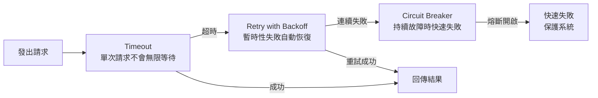

最近在研究一個問題：**當 API 請求卡住、遲遲沒有回應的時候，我們該怎麼處理？**

這個問題看起來很基本，但仔細想想，在 Production 環境中，這可是關乎整個應用程式穩定性的大事。使用者可不會乖乖等你的 Loading 轉圈圈轉到天荒地老。

今天就來聊聊三個處理 API 不穩定的關鍵策略：**Timeout**、**Retry with Backoff** 和 **Circuit Breaker**。

## 問題在哪？

想像一個情境：你的前端呼叫了一個第三方 API（比如金流、物流、或是某個資料服務），結果對方的伺服器卡住了，既不回傳成功，也不回傳失敗，就這樣 Hanging 在那邊。

如果你沒有任何防護措施，會發生什麼事？

1. **使用者體驗爆炸**：畫面一直轉圈，使用者不知道發生什麼事
2. **資源被佔用**：你的 Server 連線、Thread 被這個請求卡住，無法服務其他人
3. **連鎖反應**：一個服務卡住，可能拖垮整個系統

所以，我們需要一套「韌性」（Resilience）機制來應對這種情況。

## 第一道防線：Timeout（超時設定）

最基本但最重要的設定。**永遠不要讓一個請求無限等待**。

Timeout 的概念很簡單：設定一個時間限制，如果在這個時間內沒有收到回應，就主動放棄這次請求。

```javascript
// 使用 fetch 搭配 AbortController 實現 Timeout
async function fetchWithTimeout(url, options = {}, timeoutMs = 5000) {
  const controller = new AbortController();
  const timeoutId = setTimeout(() => controller.abort(), timeoutMs);

  try {
    const response = await fetch(url, {
      ...options,
      signal: controller.signal,
    });
    return response;
  } catch (error) {
    if (error.name === "AbortError") {
      throw new Error(`Request timeout after ${timeoutMs}ms`);
    }
    throw error;
  } finally {
    clearTimeout(timeoutId);
  }
}
```

### Timeout 該設多久？

這沒有標準答案，取決於呼叫的 API 性質：

- **一般 CRUD 操作**：3-5 秒
- **複雜查詢或報表**：10-30 秒
- **檔案上傳**：視檔案大小而定，可能需要更長

可以依照一般 UX 經驗來設定（參考其它系統的做法是一個不錯的方式），重點是：**一定要設**。寧可讓請求失敗，也不要讓它無限等待拖垮整個系統。

## 第二道防線：Retry with Backoff（重試機制）

有時候請求失敗只是暫時的——可能是網路抖動、對方伺服器正好在重啟。這時候「再試一次」可能就會成功。

但重試不能亂試，要有策略：

### Exponential Backoff（指數退避）

每次重試之間的等待時間要越來越長。為什麼？因為如果對方伺服器真的有問題，你瘋狂重試只會讓它更慘（雪上加霜）。

```javascript
async function fetchWithRetry(url, options = {}, maxRetries = 3) {
  let lastError;

  for (let attempt = 0; attempt < maxRetries; attempt++) {
    try {
      const response = await fetchWithTimeout(url, options, 5000);

      // 5xx 錯誤也要重試
      if (response.status >= 500) {
        throw new Error(`Server error: ${response.status}`);
      }

      return response;
    } catch (error) {
      lastError = error;
      console.warn(`Attempt ${attempt + 1} failed:`, error.message);

      // 最後一次就不用等了
      if (attempt < maxRetries - 1) {
        // Exponential Backoff: 1秒, 2秒, 4秒...
        const delay = Math.pow(2, attempt) * 1000;
        // 加一點隨機性，避免多個請求同時重試（Thundering Herd）
        const jitter = Math.random() * 1000;
        await sleep(delay + jitter);
      }
    }
  }

  throw new Error(`Failed after ${maxRetries} retries: ${lastError.message}`);
}

function sleep(ms) {
  return new Promise((resolve) => setTimeout(resolve, ms));
}
```

### 什麼情況該重試？

- ✅ 網路錯誤（Network Error）
- ✅ 5xx 錯誤（Server Error）
- ✅ Timeout
- ❌ 4xx 錯誤（Client Error）—— 這是你的問題，重試也沒用
- ❌ 401 認證失效 —— 通常是 Token 過期，可以先刷新 Token 再重試一次
- ❌ 403 權限不足 —— 代表身分沒問題但沒有權限，換 Token 通常沒用，不建議直接重試，需要調整權限或走其他流程

## 第三道防線：Circuit Breaker（斷路器）

這是最進階但也最重要的模式。靈感來自電路的保險絲——當電流異常時，保險絲會斷開來保護整個電路。

### 為什麼需要 Circuit Breaker？

假設某個第三方服務掛了，每個請求都要等 5 秒 Timeout，重試 3 次，加上重試之間的 Exponential Backoff 等待，一個使用者的請求可能要等 15-20 秒才會失敗。如果同時有 100 個使用者在用這個功能，你的系統會充滿這些「等待中」的請求，資源很快就會耗盡。

Circuit Breaker 的邏輯是：**如果某個服務連續失敗太多次，就暫時不要再呼叫它，直接回傳錯誤**。過一段時間後再「試探性」地呼叫看看，如果成功了就恢復正常。

### 三種狀態

1. **Closed（關閉）**：正常運作，所有請求都會送出
2. **Open（開啟）**：斷路器跳開，所有請求直接失敗，不會真的送出
3. **Half-Open（半開）**：試探階段，允許少量請求通過測試服務是否恢復

```javascript
class CircuitBreaker {
  constructor(options = {}) {
    this.failureThreshold = options.failureThreshold || 5; // 連續失敗幾次就跳開
    this.resetTimeout = options.resetTimeout || 30000; // 多久後嘗試恢復（毫秒）

    this.state = "CLOSED";
    this.failureCount = 0;
    this.lastFailureTime = null;
    this.halfOpenInFlight = false; // Half-Open 狀態下是否已有試探請求在進行
  }

  async call(fn) {
    // 如果斷路器開啟，檢查是否該進入半開狀態
    if (this.state === "OPEN") {
      if (Date.now() - this.lastFailureTime >= this.resetTimeout) {
        this.state = "HALF_OPEN";
      } else {
        throw new Error("Circuit breaker is OPEN - request blocked");
      }
    }

    // Half-Open 時只放行一個試探請求，避免服務剛恢復就被一次湧入的請求打垮
    if (this.state === "HALF_OPEN") {
      if (this.halfOpenInFlight) {
        throw new Error("Circuit breaker is HALF_OPEN - probing in progress");
      }
      this.halfOpenInFlight = true;
    }

    try {
      const result = await fn();

      // 請求成功，重置狀態
      this.onSuccess();
      return result;
    } catch (error) {
      // 請求失敗，更新失敗計數
      this.onFailure();
      throw error;
    } finally {
      this.halfOpenInFlight = false;
    }
  }

  onSuccess() {
    this.failureCount = 0;
    this.state = "CLOSED";
  }

  onFailure() {
    this.failureCount++;
    this.lastFailureTime = Date.now();

    if (this.failureCount >= this.failureThreshold) {
      this.state = "OPEN";
      console.warn("Circuit breaker opened!");
    }
  }
}

// 使用範例
const paymentBreaker = new CircuitBreaker({
  failureThreshold: 5,
  resetTimeout: 30000,
});

async function processPayment(data) {
  return paymentBreaker.call(() =>
    fetchWithRetry("https://api.payment.com/charge", {
      method: "POST",
      headers: {
        "Content-Type": "application/json",
        // 用 orderId 當 Idempotency Key：同一筆訂單就算被重試多次，
        // 伺服器端也能辨識出是同一筆請求，回傳原本的結果而不會重複扣款
        "Idempotency-Key": data.orderId,
      },
      body: JSON.stringify(data),
    }),
  );
}
```

要特別注意的是，像扣款這種**非冪等（non-idempotent）**操作，重試前務必確認 API 有支援 Idempotency Key，否則 Timeout 造成的重試可能讓使用者被重複扣款——上面範例特地帶上 `Idempotency-Key`，就是為了讓伺服器端能辨識重複請求、避免這個問題。

## 實務上的整合

在真實世界的應用中，這三個機制通常會一起使用，形成層層防護：



如果你用的是 Node.js，可以考慮使用現成的套件：

- **[cockatiel](https://www.npmjs.com/package/cockatiel)**：功能完整的 resilience 套件
- **[axios-retry](https://www.npmjs.com/package/axios-retry)**：如果你用 Axios，這個插件很方便
- **[opossum](https://www.npmjs.com/package/opossum)**：專門的 Circuit Breaker 實作

## 結語

處理「API 請求卡住」這個問題，其實反映的是一種思維方式：**在分散式系統中，任何外部依賴都可能失敗，我們必須假設它會失敗，並優雅地處理這些失敗**。

這三個模式——Timeout、Retry with Backoff、Circuit Breaker——是建構穩健系統的基本功。雖然一開始實作可能覺得麻煩，但當你的服務在某個第三方 API 掛掉時還能正常運作（至少是優雅降級），你會很慶幸有做這些防護的 😌

希望這篇對你有幫助，下次遇到 API 不穩定的情況，就知道該怎麼處理了！

---

站內相關文章：

- [前端測試實戰 — Vitest 入門](/posts/frontend-testing-vitest-guide)
- [Nuxt 3 JWT 身份驗證實作筆記](/posts/nuxt3-jwt-pinia-auth)
