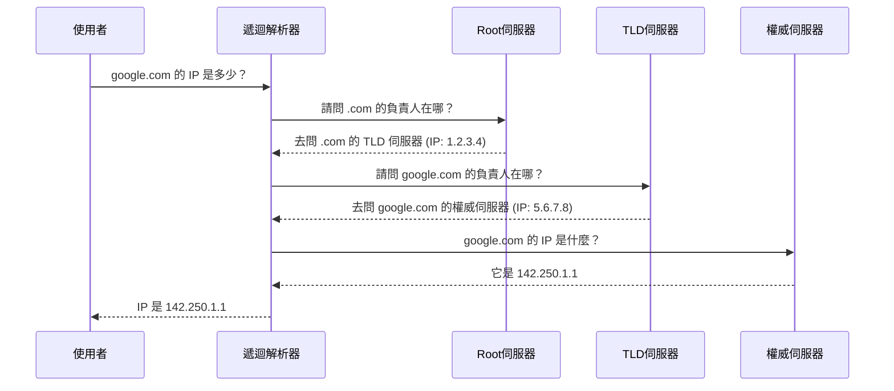

---
title: DNS 深度解析 — 網路世界的地址簿與導航系統
description: 深入探討 DNS 運作原理，從遞迴查詢到各類紀錄 (A, CNAME, MX)，以及當 DNS 故障時該如何排查。
date: 2026-02-12
tags: [網路, DNS, 後端]
category: web-basics
---

我們在[網路運作原理](/posts/how-the-internet-works)中提到了 DNS (Domain Name System) 將網址轉換為 IP 位址。但這個過程究竟是如何發生的？為什麼有時候網站明明沒掛，你卻連不上？今天我們就來深度解析這個網路世界的地址簿。

## DNS 的階層式架構

DNS 不是一本巨大的電話簿，而是一個**分散式、階層式**的資料庫系統。想像它像是一個跨國公司的組織架構：

1.  **根域名伺服器 (Root Nameservers)**：總公司，知道每個頂級域名 (.com, .tw, .org) 的負責人在哪。
2.  **頂級域名伺服器 (TLD Nameservers)**：部門經理，管理特定結尾的網域 (例如 .com 的註冊局)。
3.  **權威名稱伺服器 (Authoritative Nameservers)**：專案負責人，真正知道該網域 IP 的伺服器 (通常是 Cloudflare, AWS Route53 或你的網域註冊商)。

## 當你輸入 google.com 時發生了什麼事？

這是一個**遞迴查詢 (Recursive Query)** 的過程：



**遞迴解析器 (Recursive Resolver)** 通常由你的 ISP (中華電信) 或公共 DNS (Google 8.8.8.8, Cloudflare 1.1.1.1) 提供。它負責幫你跑腿問路，並且**快取 (Cache)** 結果。下次再問同樣的網址，它就不用重新跑一次流程了。

## 常見的 DNS 紀錄類型

在 DNS 設定中，你會看到各種不同類型的紀錄 (Records)，它們有不同的用途：

### A 與 AAAA 紀錄

- **A (Address)**：將域名指向 **IPv4** 位址 (例如 `192.168.1.1`)。這是最基本的紀錄。
- **AAAA**：將域名指向 **IPv6** 位址。隨著 IPv4 枯竭，這越來越重要。

### CNAME (Canonical Name)

將一個域名指向**另一個域名**，而不是 IP。

- 例子：`blog.example.com` -> `example.com`
- 用途：當 IP 變更時，只需要改 `example.com` 的 A 紀錄，其他 CNAME 會自動指向新的 IP。適合用於子網域或指向 CDN (如 Heroku, Vercel)。

### MX (Mail Exchanger)

指定負責處理該網域**電子郵件**的伺服器。

- 當有人寄信給 `user@example.com`，郵件伺服器會去查 `example.com` 的 MX 紀錄，知道該把信投遞到哪裡 (例如 Gmail 或 Outlook 的伺服器)。

### TXT (Text)

原本是用來放任意文字說明，現在主要用於**驗證與安全性**。

- **SPF (Sender Policy Framework)**：防止別人偽造你的網域寄信。
- **網域所有權驗證**：Google Search Console 或 SSL 憑證驗證時常會要求加一筆 TXT 紀錄。

## DNS 故障排查 (Troubleshooting)

當網站連不上時，怎麼確認是不是 DNS 的問題？

### 1. 使用 `nslookup` 或 `dig`

在終端機輸入：

```bash
nslookup google.com
```

如果看到 `ServFail` 或找不到 IP，但在手機 4G 網路上正常，那很可能是你的 DNS 伺服器有問題。可以嘗試將電腦的 DNS 改為 `8.8.8.8` (Google) 或 `1.1.1.1` (Cloudflare)。

### 2. 檢查 TTL (Time To Live)

如果你剛修改了 DNS 設定但沒生效，可能是因為 **TTL** 還沒過期。TTL 決定了 DNS 紀錄在快取中存活多久。

- **TTL = 3600 (1小時)**：修改後，世界各地的 DNS 伺服器最多可能需要 1 小時才會更新。
- **建議**：在計畫遷移主機或修改 DNS 前，先把 TTL 調低 (例如 300秒)，可以減少轉換時的空窗期。

### 3. DNS 污染與劫持

有時候 DNS 會被惡意竄改，將你導向釣魚網站。這就是為什麼現代瀏覽器推動 **DoH (DNS over HTTPS)**，將 DNS 查詢加密，防止中間人監聽或竄改。

## 結語

DNS 真的就像是網路世界裡的隱形接線生。懂了它是怎麼運作的，以後不管是買網域自己設定，還是網路斷掉要找原因，抓漏起來都會快很多。下次上網按 Enter 的時候，不妨想像一下這個只要幾毫秒就跑遍全球的問路小劇場吧！

---

站內相關文章：

- [網路是怎麼運作的？](/posts/how-the-internet-works)
- [瀏覽器是怎麼顯示網頁的？](/posts/how-browser-renders-webpage)
