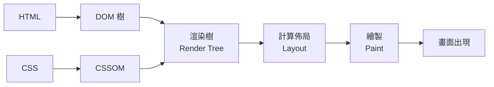

---
title: 瀏覽器是怎麼顯示網頁的？— 從輸入網址到看見畫面的完整旅程
description: 當你按下 Enter 後的那一秒鐘發生了什麼事？從 DNS 查詢、建立連線到 DOM 渲染，帶你走一遍網頁顯示的完整旅程。
date: 2026-02-10
tags: [瀏覽器, 網路, 新手入門]
category: web-basics
---

每天你打開瀏覽器、輸入網址、按下 Enter，不到一秒鐘畫面就出現了。但你有沒有想過，這短短一秒鐘裡面到底發生了什麼事？

這篇文章會帶你走過從「輸入網址」到「看見網頁」的完整旅程。我們會用**網路購物**的過程來比喻，讓這趟旅程變得更好理解。

## 整體流程：像一趟網路購物

把瀏覽器顯示網頁的過程想成你在網路上買東西：

1. **你下單**（輸入網址）
2. **查倉庫地址**（DNS 查詢）
3. **貨運去取件**（建立連線、發送請求）
4. **包裹送到你家**（接收回應）
5. **拆箱組裝**（瀏覽器渲染頁面）

讓我們一步一步來看。

## 第一步：輸入網址 — 你下了一筆訂單

當你在瀏覽器的網址列輸入 `www.google.com` 並按下 Enter，就等於你對瀏覽器下了一道指令：

> 「幫我去拿 `www.google.com` 這個網站的內容回來。」

這就像你在購物網站上按下「購買」按鈕一樣。

### 網址其實是有結構的

一個網址（URL）其實包含了好幾個資訊：

```
https://www.google.com/search?q=hello
│       │              │      │
│       │              │      └── 查詢參數（你要搜什麼）
│       │              └── 路徑（要哪個頁面）
│       └── 域名（哪個網站）
└── 協議（用什麼方式連線）
```

就像一張訂單上面會寫：「用宅配（https）寄到王小明家（google.com），要二樓倉庫（/search）裡的某個商品（?q=hello）。」

## 第二步：DNS 查詢 — 查倉庫地址

瀏覽器收到你的「訂單」，但它只知道你要去 `www.google.com`，不知道具體地址在哪裡。

這時候就需要 **DNS**（如果你看過前面那篇 [DNS 的文章](/posts/dns-explained-with-address-system)，你已經知道它了！）。

DNS 會把 `www.google.com` 翻譯成 IP 位址 `142.250.185.78`。

就像物流公司查到了倉庫的實際地址，知道該往哪裡去了。

## 第三步：建立連線 — 貨運前往取件

知道地址後，你的瀏覽器需要跟 Google 的伺服器「打個招呼」建立連線。這個過程叫做 **TCP 三次握手**。

用生活化的方式來理解：

1. 瀏覽器：「你好，請問有人在嗎？」（SYN）
2. 伺服器：「在的，我準備好了，你呢？」（SYN-ACK）
3. 瀏覽器：「我也準備好了，開始吧！」（ACK）

三次確認之後，連線就建立了。就像貨運司機到了倉庫門口，跟管理員確認身份之後，才能進去取貨。

### HTTPS 的額外步驟

如果網址是 `https://`（現在大多數網站都是），還會多一個 **SSL/TLS 加密** 的步驟。簡單說就是雙方約定好一個「暗號」，之後的所有通訊都會被加密。

就像你寄貴重物品時會使用有鎖的箱子，而且只有你和收件人有鑰匙。

## 第四步：發送請求、接收回應 — 取貨送貨

### Request — 瀏覽器發送請求

連線建好之後，瀏覽器會發送一個 **HTTP 請求（Request）** 給伺服器，大概長這樣：

```
GET /search?q=hello HTTP/1.1
Host: www.google.com
Accept: text/html
```

翻譯成白話文就是：

> 「我想要（GET）你 search 頁面裡 q=hello 的內容，請給我 HTML 格式。」

### Response — 伺服器回傳回應

伺服器收到請求後，處理完（去資料庫查資料、跑程式邏輯等），會回傳一個 **HTTP 回應（Response）**：

```
HTTP/1.1 200 OK
Content-Type: text/html

<!DOCTYPE html>
<html>
  <head><title>搜尋結果</title></head>
  <body>
    <h1>搜尋結果：hello</h1>
    ...
  </body>
</html>
```

### 那個 200 是什麼？— HTTP 狀態碼

回應的開頭有一個數字 `200`，這就是 **HTTP 狀態碼**，用來告訴你這次「取貨」的結果：

<div class="table-wrapper">

| 狀態碼 | 意思       | 生活化比喻                         |
| ------ | ---------- | ---------------------------------- |
| 200    | 成功       | 包裹順利送到了 ✅👌                |
| 301    | 永久搬家了 | 這家店搬走了，新地址是 XXX         |
| 404    | 找不到     | 你要的東西不存在（最常見的錯誤）❌ |
| 500    | 伺服器出錯 | 倉庫裡面出問題了，沒辦法出貨 🔥    |

</div>

下次你看到 404 頁面，就知道是「瀏覽器去拿東西，但伺服器說找不到」。

## 第五步：瀏覽器渲染 — 拆箱組裝

好，包裹（HTML、CSS、JavaScript 檔案）送到你的瀏覽器了。但一堆程式碼要怎麼變成你看到的漂亮網頁？

這就是**渲染（Rendering）**的過程，也就是「拆箱組裝」。

整個渲染流程可以用這張圖來理解：



### 瀏覽器的組裝流程

#### 1. 解析 HTML → 建立 DOM 樹

瀏覽器先讀 HTML，把每個標籤整理成一棵「樹」，叫做 **DOM（Document Object Model）**。

你可以把 DOM 想成一份行政組織架構圖：

```
html
├── head
│   └── title
└── body
    ├── h1
    ├── p
    └── ul
        ├── li
        ├── li
        └── li
```

每個標籤都是一個節點，有自己的位置和上下關係。

#### 2. 解析 CSS → 建立 CSSOM

同時，瀏覽器也在讀 CSS，建立一棵「樣式樹」叫 **CSSOM**。它記錄了每個元素應該長什麼樣（顏色、大小、位置…）。

#### 3. 合併 → 建立渲染樹

DOM + CSSOM = **渲染樹（Render Tree）**。

這就像把「材料清單」和「組裝說明書」合在一起，瀏覽器就知道要畫什麼、畫在哪、畫成什麼樣。

#### 4. 計算佈局（Layout）

瀏覽器計算每個元素的確切大小和位置。「這個標題要放在左上角，寬度是 800px…」

#### 5. 繪製（Paint）

最後，瀏覽器把所有東西畫到螢幕上。你終於看到網頁了！

### 那 JavaScript 呢？

JavaScript 是在 HTML 解析的過程中被載入和執行的。但它有一個特殊性質：**它會暫停 HTML 的解析**。

就像你在組裝家具的時候，突然發現有一張額外的施工說明書，你得先看完、照著做完，才能繼續組裝。

這就是為什麼很多網站會把 JavaScript 放在 HTML 的最後面，或者加上 `defer` 屬性 — 讓 HTML 先解析完，再執行 JavaScript，這樣頁面能更快出現。

## 為什麼有些網站比較慢？

理解了瀏覽器的渲染流程之後，你就能明白為什麼有些網站跑很慢：

### 1. 檔案太大

HTML、CSS、JavaScript、圖片越多越大，下載時間就越長。就像你買了一大堆東西，貨運車要跑好幾趟才能送完。

### 2. JavaScript 太多太重

JavaScript 會暫停 HTML 解析，如果 JavaScript 很多，頁面就要等很久才能顯示。

### 3. 圖片沒有優化

一張 5MB 的高解析度照片，跟一張 100KB 的壓縮過照片，載入速度天差地遠。

### 4. 伺服器回應慢

後端處理太久、資料庫查詢太慢，都會讓使用者等更久。

這些都是前端工程師每天在處理的**效能優化**問題。如果你對這個主題有興趣，我之前寫過一篇 [LCP 優化的文章](/posts/lcp-optimization-tips)，歡迎看看。

## 結語

回顧一下從輸入網址到看見畫面的完整旅程：

1. **輸入網址** → 對瀏覽器下指令
2. **DNS 查詢** → 把域名翻譯成 IP 位址
3. **建立連線** → TCP 三次握手 + HTTPS 加密
4. **Request / Response** → 瀏覽器請求，伺服器回應
5. **渲染頁面** → 解析 HTML/CSS → 建 DOM 樹 → 計算佈局 → 繪製畫面

這一切都在眨眼之間完成。下次你打開一個網頁的時候，不妨想想看——在那短短不到一秒鐘裡，有多少幕後工作在替你完成。

---

延伸閱讀：

- [Google — 瀏覽器的運作方式](https://web.dev/articles/howbrowserswork)
- [MDN — 關鍵渲染路徑](https://developer.mozilla.org/en-US/docs/Web/Performance/Guides/Critical_rendering_path)（英文）
