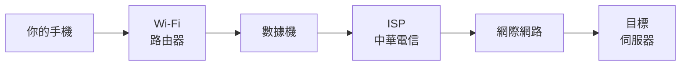

你現在正在用網路讀這篇文章。但你有沒有想過，這些文字和圖片是怎麼從世界的某個角落，傳到你面前的螢幕上的？

這篇文章會帶你認識網路運作的全貌——從最底層的實體設備，到你每天都在使用卻可能沒注意到的小細節。

## 網路其實是一堆「線」

很多人以為網路是「無線」的，資料透過衛星或什麼神秘的方式在天上飛來飛去。

事實上，**全球超過 95% 的跨洲（國際）網路流量都是靠海底電纜傳輸的**——同一國家或城市內部的流量（例如同機房、鄰近資料中心之間）本來就不需要跨海。

### 海底電纜 — 網路世界的高速公路

想像一下，全世界的城市之間被一條條高速公路連接起來。網路世界裡的「高速公路」就是**海底電纜**——一條條鋪在海底的光纖電纜，將各大洲連接在一起。

這些電纜：

- 總長度超過 **130 萬公里**（可以繞地球 30 幾圈）
- 直徑大約跟花園水管一樣粗
- 裡面是極細的光纖，用**光的速度**傳輸資料
- 由 Google、Meta、Microsoft 等科技公司和電信商共同出資鋪設

所以當你打開一個美國的網站，你的資料很可能真的穿越了太平洋的海底才到達那台伺服器（不過如果該網站有透過 CDN 在鄰近地區部署快取，熱門內容不一定每次都要橫跨大洋，詳見〈[CDN 與 Edge Computing](/posts/cdn-edge-computing/)〉一文）。聽起來是不是很壯觀？

### 那 Wi-Fi 和行動網路呢？

Wi-Fi 和 4G/5G 只是**最後一段**的無線連接——從你家的路由器到你的手機或電腦。在那之前，資料都是透過有線的方式傳輸的（光纖、電纜、海底電纜）。

把它想成快遞的最後一哩路：

- 包裹從倉庫出發，走高速公路（海底電纜）
- 到了你的城市，走一般道路（光纖到你家附近的機房）
- 最後由外送員步行送到你家門口（Wi-Fi 無線傳輸）

## ISP — 你的網路入口

### ISP 是什麼？

ISP 的全名是 **Internet Service Provider**（網際網路服務提供商），就是你付錢買網路的那家公司。在台灣最常見的就是**中華電信**、**凱擘**、**遠傳**等。

### ISP 做了什麼？

你可以把 ISP 想成高速公路的**收費站兼交流道**：

<div class="table-wrapper" tabindex="0" role="group" aria-label="表格（可水平捲動）">

| 高速公路           | 網路世界                         |
| ------------------ | -------------------------------- |
| 收費站             | ISP 收你的月租費                 |
| 交流道             | ISP 把你連上網路骨幹             |
| 高速公路的速限     | 你的網路方案速度（100M/300M/1G） |
| 收費站之間互相連接 | 各家 ISP 之間有互聯交換          |

</div>

當你在家連上 Wi-Fi 上網時，流程是：



ISP 就是那個讓你的家庭網路「接上」全球網路的中間人。

## 伺服器 — 其實就是一台電腦

### 伺服器到底是什麼？

很多人覺得「伺服器」是個很厲害的東西。事實上：

> **伺服器就是一台長時間開著、專門用來提供服務的電腦。**

你的筆電可以是伺服器，你的桌機也可以是伺服器——只要你讓它持續運行，並且可以讓別人透過網路連進來。

### 跟你的電腦有什麼不同？

當然，專業的伺服器跟你的筆電還是有一些差異：

<div class="table-wrapper" tabindex="0" role="group" aria-label="表格（可水平捲動）">

| 你的電腦         | 專業伺服器                   |
| ---------------- | ---------------------------- |
| 放在桌上或包包裡 | 放在專用的機房（資料中心）   |
| 用完就關機       | 24/7 全年無休運作            |
| 你一個人用       | 同時服務成千上萬的使用者     |
| 有螢幕有鍵盤     | 通常沒有螢幕，靠遠端操作     |
| 家用等級的零件   | 企業級硬體，有備援和散熱系統 |

</div>

### 機房長什麼樣？

Google、Amazon、Microsoft 這些大公司在全球各地都有**資料中心（Data Center）**。想像一個巨大的倉庫，裡面放著成千上萬台伺服器，有獨立的供電系統、冷卻系統和安全管制。

你每次搜尋 Google、看 YouTube、滑 Instagram，你的請求最終會被送到這些資料中心裡的某一台伺服器上——不過熱門內容常常會先被鄰近的快取伺服器（CDN／Edge Server）攔下來，不用每次都跑到最遠的機房，詳見〈[CDN 與 Edge Computing](/posts/cdn-edge-computing/)〉一文。

## Request 和 Response — 寄信和回信

我們在[瀏覽器那篇文章](/posts/how-browser-renders-webpage/)有提過 Request 和 Response，這裡用另一個角度再解釋一次。

### 網路的溝通方式就像寄信

<div class="table-wrapper" tabindex="0" role="group" aria-label="表格（可水平捲動）">

| 寄信流程         | 網路流程                        |
| ---------------- | ------------------------------- |
| 你寫一封信       | 瀏覽器發出 HTTP Request         |
| 信上寫收件地址   | Request 裡包含目標伺服器的 IP   |
| 信上寫你的地址   | Request 裡包含你的 IP（寄件人） |
| 信裡面的內容     | Request 的參數（你要什麼資料）  |
| 郵差把信送到     | 資料透過網路傳到伺服器          |
| 對方讀完信寫回信 | 伺服器處理完畢，產生 Response   |
| 回信寄到你家     | Response 傳回你的瀏覽器         |
| 你拆開信讀內容   | 瀏覽器解析內容、渲染畫面        |

</div>

### 實際上一次 Request 包含什麼？

```
GET /index.html HTTP/1.1
Host: www.example.com
User-Agent: Chrome/120
Accept: text/html
Accept-Language: zh-TW
```

翻譯成白話文：

- **GET**：我想要「拿」某個東西（不是修改，只是看）
- **/index.html**：我要的是首頁
- **Host**：我要去 `www.example.com` 這個網站
- **User-Agent**：我用的是 Chrome 瀏覽器
- **Accept-Language**：我偏好繁體中文

伺服器的 Response：

```
HTTP/1.1 200 OK
Content-Type: text/html

<html>
  <head><title>歡迎</title></head>
  <body><h1>你好！</h1></body>
</html>
```

就這樣，一來一往，你就看到網頁了。

## 資料庫 — 伺服器裡的大倉庫

很多網站需要存放大量資料：會員帳號、商品資訊、文章內容、訂單記錄…… 這些資料不是寫死在程式碼裡的，而是存在 **資料庫（Database）** 裡。

你可以把資料庫想成倉庫裡的**貨架**：

- 每個貨架是一張**資料表（Table）**
- 貨架上每個格子是一筆**記錄（Record）**
- 格子裡的每個欄位是一個**欄位（Field）**

```
會員資料表：
┌──────┬──────────┬────────────────────┐
│  ID  │  名字    │  Email             │
├──────┼──────────┼────────────────────┤
│  1   │  Aaron   │  aaron@example.com │
│  2   │  小明    │  ming@example.com  │
│  3   │  小美    │  mei@example.com   │
└──────┴──────────┴────────────────────┘
```

當你登入一個網站時，伺服器就是去資料庫裡查：「有沒有這個帳號？密碼對不對？」

## 你可能不知道的網路小知識

### Favicon — 網頁分頁上的小圖示

你有注意過瀏覽器分頁上的小圖示嗎？Google 的分頁上有一個小小的彩色 G、YouTube 有一個紅色播放鍵——這個小圖示叫做 **Favicon**。

**Favicon** = **Fav**orite + **Icon**（最愛的圖示）

原本是用在書籤上的圖示（加入「我的最愛」時顯示），後來被用在分頁標籤、搜尋結果等地方。

設定 favicon 很簡單，只要在 HTML 的 `<head>` 裡加一行：

```html
<link rel="icon" href="/favicon.ico" />
```

雖然是小小的細節，但有沒有 favicon 會影響網站的專業感。你可以觀察一下，幾乎所有正式的網站都有自己的 favicon。

### 為什麼叫「瀏覽器」？

瀏覽器的英文是 **Browser**，意思是「瀏覽的工具」。就像你走進書店「瀏覽」書架上的書一樣，瀏覽器讓你「瀏覽」網路上的網頁。

常見的瀏覽器：

- **Chrome**（Google 的，市占率最高）
- **Safari**（Apple 的，Mac/iPhone 預設）
- **Firefox**（Mozilla 的，開源）
- **Edge**（Microsoft 的，Windows 預設）

它們做的事情都一樣：發送 Request 給伺服器、接收 Response、把 HTML/CSS/JS 渲染成你看到的畫面。

### 為什麼有些網站網址有 www，有些沒有？

`www` 其實只是一個「子域名」，代表 **World Wide Web**。以前的慣例是用 `www` 開頭來標示這是一個網站服務。

現在很多網站已經不需要加 `www` 了（像是 `google.com` 和 `www.google.com` 都能用），但這需要 DNS 設定好。這只是歷史慣例，沒有技術上的必要性。

### HTTP 跟 HTTPS 差在哪？

- **HTTP**：資料是「明文」傳送的，就像寄明信片，路上任何人都能看到內容
- **HTTPS**：資料是「加密」傳送的，就像寄密封信件，只有你和收件人能看到

現代網站幾乎都使用 HTTPS。部分瀏覽器（如 Firefox、Safari）會在網址列旁顯示 🔒 小鎖頭代表 HTTPS 加密連線；市占率最高的 Chrome 近年已改用「調整」（滑桿）圖示取代鎖頭，但點進去一樣能看到「連線安全」的標示。

## 把所有東西串在一起

讓我們用一個完整的故事，把今天提到的所有角色串起來。

### 當你打開 `www.youtube.com` 的時候：

1. **你的電腦**透過 **Wi-Fi** 連到你家的路由器
2. 路由器透過**數據機**連到 **ISP（中華電信）** 的網路
3. ISP 的 DNS 伺服器把 `www.youtube.com` 翻譯成一個 IP 位址
4. 你的 **Request** 從 ISP 出發，透過**光纖和海底電纜**，傳到 Google 在美國（或亞洲）的**資料中心**
5. 資料中心裡的**伺服器**收到你的 Request，從**資料庫**裡找到 YouTube 首頁的內容
6. 伺服器把 **Response**（HTML、CSS、JavaScript、影片資料）傳回來
7. 資料沿著**海底電纜**回到台灣，經過 **ISP**、你家的路由器、**Wi-Fi**，最後到達你的電腦（如果該內容已經被 CDN 快取在鄰近的節點，這一段就不用真的跨海）
8. 你的**瀏覽器**接收到這些檔案，解析 HTML、套用 CSS、執行 JavaScript
9. 畫面出現了 YouTube 的首頁，連 **favicon**（那個紅色播放鍵）都顯示在分頁上

**整個過程不到一秒鐘。**

你的請求可能跨越了半個地球，穿過海底數千公里的電纜，經過無數台路由器和交換機——但你只會感覺到「啪，網頁出現了」。

## 結語

回顧一下今天學到的所有角色：

- **海底電纜** = 網路的高速公路，連接全世界
- **ISP** = 你的網路入口（中華電信等）
- **伺服器** = 專門提供服務的電腦，放在資料中心裡
- **Request / Response** = 瀏覽器跟伺服器之間的一來一往
- **資料庫** = 伺服器裡存放資料的倉庫
- **瀏覽器** = 你用來瀏覽網頁的軟體
- **Favicon** = 分頁上的小圖示
- **HTTPS** = 加密的安全連線

網路技術聽起來很遙遠，但其實它就在你日常生活的每一秒鐘裡運作著。希望讀完這篇文章之後，你對我們每天使用的網路有了更具體的認識。

---

延伸閱讀：

- [Submarine Cable Map — 全球海底電纜地圖](https://www.submarinecablemap.com/)
- [How Does the Internet Work? — MDN](https://developer.mozilla.org/en-US/docs/Learn/Common_questions/Web_mechanics/How_does_the_Internet_work)
- [Cloudflare — 什麼是 HTTPS？](https://www.cloudflare.com/zh-tw/learning/ssl/what-is-https/)
