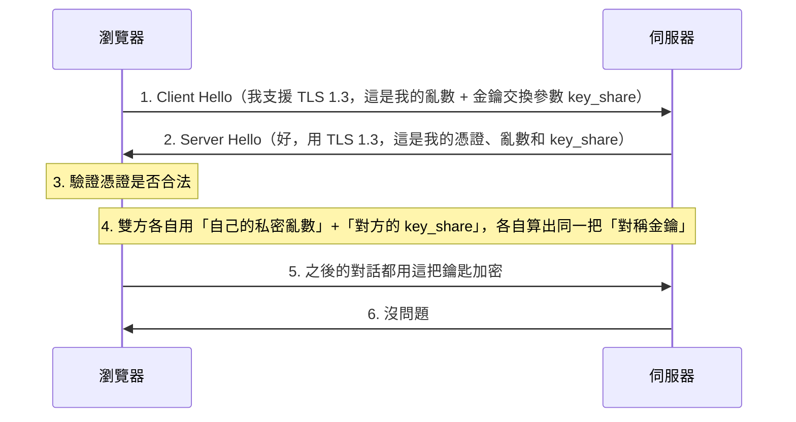

現在瀏覽網頁，如果網址列沒有出現一個 🔒 小鎖頭，瀏覽器可能會跳出「不安全」的警告。這個小鎖頭代表網站使用了 **HTTPS（HyperText Transfer Protocol Secure）**。

但它是怎麼運作的？為什麼加個 S 就能「安全」？

## HTTP 的問題：明信片傳情

普通的 HTTP 就像寄明信片。你在明信片上寫了「我的密碼是 123456」，郵差看得到，轉運站的人看得到，甚至鄰居也可能瞄到。在網路世界，這意味著你的帳號密碼在傳輸過程中是**明文**的，任何中間人（ISP、公共 Wi-Fi 駭客）都能輕易竊聽。

## HTTPS 的解法：信封加鎖

HTTPS 則是先把信裝進信封，再鎖進一個保險箱寄出去。只有收件人有鑰匙能打開保險箱。這個「保險箱」機制就是 **TLS（Transport Layer Security）**，它的前身就是有名的 **SSL**。

## 核心概念：兩種加密方式

要理解 TLS，得先懂兩種加密：

### 1. 對稱加密（Symmetric Encryption）

- **原理**：用**同一把鑰匙**鎖上和打開。
- **優點**：速度快，效率高。
- **缺點**：怎麼把鑰匙安全地交給對方？如果鑰匙在傳送過程中被攔截，加密就沒用了。

### 2. 非對稱加密（Asymmetric Encryption）

- **原理**：有兩把鑰匙，**公鑰（Public Key）** 和 **私鑰（Private Key）**。
  - 用公鑰鎖上的，只能用私鑰打開。
  - 用私鑰鎖上的，只能用公鑰驗證。
- **優點**：不用擔心鑰匙被竊聽（公鑰本來就是公開的）。
- **缺點**：運算複雜，速度慢。

## TLS 握手（Handshake） — 建立信任的過程

TLS 聰明地結合了兩者：利用**非對稱加密**來安全地交換**對稱加密**的鑰匙。這個過程稱為「握手」。

1. **打招呼**：瀏覽器跟伺服器說 Hello，同時各自附上一組用來交換金鑰的隨機參數（key_share），確認要用哪種加密演算法。
2. **給憑證**：伺服器把自己的身分證（SSL 憑證）和自己的 key_share 一起交給瀏覽器，憑證裡包含**公鑰**。
3. **驗證**：瀏覽器檢查憑證是不是合法的 CA（Certificate Authority）發的、有沒有過期。
4. **交換鑰匙**：瀏覽器和伺服器分別用「自己的私密亂數」和「對方傳來的 key_share」，透過（Elliptic Curve）Diffie-Hellman 演算法各自獨立算出同一把祕密——這把祕密從頭到尾都不會真的在網路上傳輸，就算封包被攔截也無法還原。
5. **生成會話金鑰**：雙方用這把共同祕密生成一把**對稱金鑰（Session Key）**。
6. **開始加密通訊**：接下來的資料傳輸都改用這把對稱金鑰來加密，速度就很快了。

這套做法叫做 **(EC)DHE（Diffie-Hellman Ephemeral）金鑰交換**，也是 TLS 1.3 唯一支援的方式。舊版 TLS（如 TLS 1.2 以前）允許瀏覽器直接用伺服器公鑰加密一個亂數傳過去，但這種做法不具「前向保密（Forward Secrecy）」——只要伺服器私鑰哪天外洩，過去側錄下來的封包也能被回頭解密。TLS 1.3 因此完全移除了這種舊式作法，並且把握手縮短到只需 1 個 RTT（一來一回）就能完成，比舊版更快、更安全。

## SSL 憑證（Certificate）

憑證就像網站的身分證。它由受信任的第三方機構（CA）發行，證明「`google.com` 真的是 Google 的」。

如果憑證有問題（例如過期、網域名稱不符），瀏覽器就會攔截並顯示紅色警告，保護使用者不被釣魚網站欺騙。

現在有了 **Let's Encrypt** 這樣的免費 CA，取得憑證變得非常容易且自動化，這也是為什麼 HTTPS 能普及到幾乎所有網站的原因。

## 結語

下次上網看到網址旁邊那個小鎖頭，你就知道背後發生了多酷的事情啦！你的瀏覽器和伺服器在幾毫秒內神不知鬼不覺地完成了一次超複雜的握手，協商出一把只有彼此知道的加密金鑰，確保你們的對話絕對安全，連駭客也拿你們沒轍。

---

站內相關文章：

- [DNS 深度解析](/posts/dns-deep-dive)
- [HTTP 方法與狀態碼](/posts/http-methods-status-codes)
