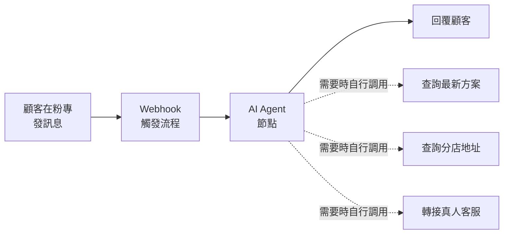

最近開始學 n8n，主要是想把一些日常的重複性工作自動化。用了一陣子之後覺得蠻有趣的，這篇來記錄一下我從零開始學的過程，還有一些心得分享。

## 為什麼想學 n8n

這次學 n8n 是因為工作上有需要。主管請我研究一下，看能不能用它做出一個「住在臉書粉專上的 24 小時客服」——也就是當顧客在粉專發訊息進來時，能自動回覆常見問題，不用人力全天候盯著訊息。

對公司來說，這種需求很實際。客服訊息常常集中在下班時間或假日進來，但人不可能 24 小時待命。如果能用自動化先擋下一輪常見問題、再把真的需要人處理的轉給真人，就能省下不少人力，顧客也不用等到隔天才有回應。

我之前有聽過 Zapier、Make 這類自動化工具，但它們大多是付費的，免費額度也很有限。後來看到很多人在推薦 n8n，說它是開源的、可以自己架在自己的伺服器上，免費又彈性，剛好很適合拿來串接 Facebook 的訊息和後續的處理流程，就決定從它開始研究。

## n8n 是什麼

簡單講，n8n 是一個工作流自動化工具。你可以把它想像成一條生產線：資料從某個地方進來，經過一連串的處理，最後送到另一個地方去。

它最大的特色是「視覺化」。你不用寫一堆程式碼，而是在畫面上拉一個一個的節點（node），把它們連起來，就組成了一條自動化流程。每個節點負責一件事，資料就沿著連線一路流過去。

拿前面提到的粉專客服來說，我實際做的時候，核心是一個 [**AI Agent 節點**](https://docs.n8n.io/integrations/builtin/cluster-nodes/root-nodes/n8n-nodes-langchain.agent/)，再把幾個工具串接給它。流程概念大概長這樣：

關鍵在於我不用自己寫一堆 if-else 去判斷顧客問的是什麼。我只要在 AI Agent 的 system prompt 裡告訴它「當需要的時候，可以自己調用這些工具」，再把工具串上去。這樣顧客問「最近有什麼方案」，AI 就會自己去叫「查詢最新方案」這個工具；問「你們在哪裡」，它就去查分店地址；遇到處理不了的，就轉給真人。要判斷該用哪個工具、要不要查資料，這些都交給 AI 自己決定。

跟 Zapier、Make 比起來，n8n 的優勢在於：

- **開源免費**：可以自己架設，不用付月費
- **彈性高**：需要的時候可以直接寫 JavaScript 處理資料
- **節點豐富**：內建超多服務的整合，常見的工具幾乎都有

## 幾個核心觀念

剛開始學的時候，有幾個觀念搞懂之後就順很多。

### 節點（Node）

節點是 n8n 的基本單位，每個節點負責一個動作。比如「讀取一封 email」是一個節點、「把資料寫進 MongoDB」是另一個節點。你把需要的節點一個個加進來、串起來，就是一條完整的流程。

### 觸發器（Trigger）

每條流程都要有一個起點，這個起點就是觸發器。觸發器決定了流程「什麼時候會跑」。常見的有幾種：

- **手動觸發**：在 n8n 的介面上點擊按鈕來觸發整段流程
- **定時觸發**：每隔一段時間自動執行，像是每天早上九點
- **Webhook 觸發**：有人打了某個網址，流程就被觸發
- **事件觸發**：某個服務發生特定事件時觸發，例如收到新的表單回覆

### 資料的流動

這是我一開始最不習慣的地方。在 n8n 裡，資料是以 JSON 的形式，從一個節點流到下一個節點。前一個節點的輸出，會變成下一個節點的輸入。

理解了「資料是一路傳遞下去的」這件事之後，要怎麼在後面的節點引用前面的資料、要怎麼做轉換，就清楚多了。

## 我實際的開發過程

因為我本身就有開發的觀念和基礎，所以沒有從那種「表單自動發通知」的玩具範例慢慢練起，而是直接進到 AI 客服的開發流程，邊做邊把 n8n 學起來。

整個專案大致是這樣推進的：

1. **建立 Meta App**：要讓流程能收到粉專的訊息、也能回覆回去，第一步得先到 Meta 開發者後台建立一個 App，設定 Messenger 的權限、串好 Webhook，把粉專跟這個 App 綁定起來。
2. **設計 n8n 流程**：在 n8n 裡用 Webhook 接收 Meta 傳過來的訊息，中間接上前面提到的 AI Agent 節點，再把查方案、查分店地址這些工具串給它，最後把 AI 產生的回覆送回 Messenger。
3. **包成一個 SaaS 平台**：因為希望這套東西不只服務一個粉專，而是能讓不同商家各自接上自己的粉專來用，所以我用 AI 協作開發，做了一個 SaaS 平台，把 Meta App 的授權串接、設定管理跟背後的 n8n 流程整合在一起。

這段過程其實同時在學兩件事：一邊搞懂 n8n 怎麼拉流程、怎麼設定 AI Agent，一邊處理 Meta 平台那些瑣碎的授權和 Webhook 設定。不熟的地方很多，但有 AI 一起協作，卡關的時候隨時能問，整體推進得比我預期快不少。

## 一邊看課程，一邊用 AI 輔助學

我這整個學習過程，是一邊看一個免費的 n8n 課程，一邊搭配 AI 來輔助學的。這個組合對我來說效果很好。

課程負責給我一個完整的學習脈絡，從最基礎的觀念一步步帶到實際應用，不會東學一塊西學一塊。而 AI 則是補足課程沒有覆蓋到的地方，當作我隨時可以發問的助教。

實際上我會這樣用 AI：

**卡關的時候問**：流程跑不起來、某個節點一直報錯，我就把設定和錯誤訊息貼給 AI，請它幫我看問題在哪。很多時候是資料格式或欄位引用的小錯誤，AI 一下就抓出來了。

**寫表達式和程式碼**：n8n 有些地方要寫表達式來引用資料，複雜一點的還要在 Code 節點裡寫 JavaScript。這時候我會描述想達成的效果，請 AI 幫我寫，再自己看懂、調整。

**理解觀念**：看課程遇到不太懂的名詞或設計，我會請 AI 用白話再解釋一次，或舉個例子。這種互動式的補充，比單純重看一遍有效率。

**整段流程丟給 AI 看**：這點我覺得特別好用。n8n 的流程可以直接匯出成一份 JSON，把整個流程的節點、設定、連線都完整描述出來。所以遇到問題、或想請 AI 幫忙檢查的時候，我會直接把整段 JSON 複製給 AI，它就能看懂我整條流程長什麼樣、是怎麼串的，不用我一個節點一個節點慢慢解釋。要請它幫忙找哪裡接錯、或建議怎麼調整，都方便很多。

不過要提醒的是，AI 給的答案不一定對，尤其 n8n 介面更新蠻快的，有時候它講的選項位置已經不一樣了。所以還是要以課程和官方文件為主，AI 當輔助，不能完全照單全收。

## 一些學習心得

學到現在，有幾點想分享給也想入門的人。

**先求跑起來，再求漂亮**：一開始不用想著做出多完美的流程，先把一個簡單的自動化從頭到尾跑通，建立信心和手感最重要。

**善用測試功能**：n8n 可以單獨執行某個節點看輸出結果，遇到問題的時候一個節點一個節點檢查，很快就能找到是哪裡出錯。

**從自己的真實需求下手**：與其照著範例做一個用不到的流程，不如挑一件自己平常真的會重複做的事來自動化，做出來馬上就能用，動力也會更強。

**基礎觀念還是要懂**：雖然 n8n 不用寫太多程式，但 JSON、API、Webhook 這些基本觀念懂一點，學起來會輕鬆很多。這也是 AI 可以幫上忙的地方，遇到不懂的隨時問。

## 結語

學 n8n 這段時間，最大的感想是「原來自動化沒有想像中難」。以前覺得要寫一堆程式、架一堆東西才能做到的事，現在用拉節點的方式就能組出來，門檻低很多。

對於想提升日常工作效率、又不想花錢買付費工具的人，n8n 真的很值得學。把那些煩人的重複工作交給它，省下來的時間就能拿去做更有價值的事。

最後，附上我這次學習主要跟著走的免費課程。我就是一邊看這個課程、一邊用 AI 輔助，從零開始把 n8n 學起來的，內容很完整，推薦給想入門的人。另外也一併附上 n8n 的官方文件，遇到課程沒提到的節點或設定，查官方文件最準：

---

- 免費課程：[n8n 免費教學課程（YouTube 播放清單）](https://www.youtube.com/watch?v=o7Xp2OUOczA&list=PLBd8JGCAcUAEWlyAtVTaoFsaxvXACdZLA)
- 官方文件：[n8n Docs](https://docs.n8n.io/)
