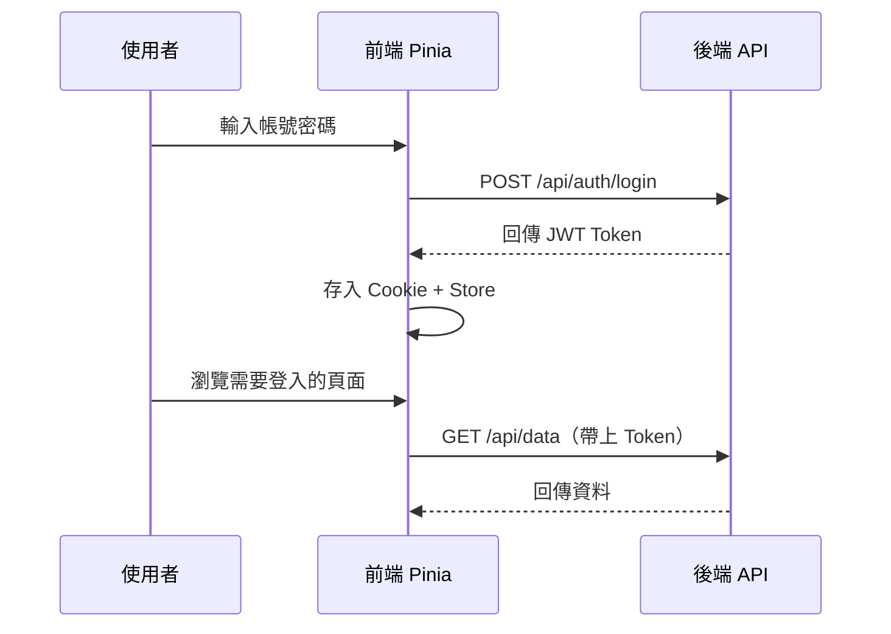

最近幾個專案都有碰到會員系統的需求，JWT 驗證機制用了好幾次，這篇來整理一下在 Nuxt 3 專案中實作 JWT 驗證的心得。

## JWT 是什麼

JWT（JSON Web Token）是一種用來驗證使用者身份的機制。流程大概是這樣：

1. 使用者輸入帳號密碼登入
2. 後端驗證成功後，產生一組 JWT 回傳給前端
3. 前端把這個 token 存起來
4. 之後每次打 API 都帶上這個 token
5. 後端收到請求時，驗證 token 是否有效

JWT 的好處是後端不用維護 session，每個請求都是獨立的，比較好做水平擴展。



## 前端需要處理什麼

前端在 JWT 驗證流程中要處理的事情：

1. 登入時把 token 存起來
2. 每次打 API 時自動帶上 token
3. 處理 token 過期的情況
4. 登出時清除 token
5. 重新整理頁面時恢復登入狀態

## Cookie + Pinia 雙層管理

實務上最常見的做法是 **Cookie 存 token，Pinia 管理狀態**。

Cookie 負責持久化儲存，這樣重新整理頁面或關掉瀏覽器再開，token 還會在。Pinia 則是讓全站都可以方便地存取登入狀態，不用每次都去讀 cookie。

```typescript
// stores/auth.ts
export const useAuthStore = defineStore("auth", () => {
  const tokenCookie = useCookie("auth_token", {
    // 範例為求簡化，用 7 天的長效單一 token；
    // 正式環境建議改用短效 access token（幾小時內）+ refresh token，並實作換發機制
    maxAge: 60 * 60 * 24 * 7, // 7 天
    secure: true,
    sameSite: "strict",
  });

  const user = ref<User | null>(null);
  const isLoggedIn = computed(() => !!tokenCookie.value);

  const login = async (credentials: LoginCredentials) => {
    const { token, userData } = await $fetch("/api/auth/login", {
      method: "POST",
      body: credentials,
    });
    tokenCookie.value = token;
    user.value = userData;
  };

  const logout = () => {
    tokenCookie.value = null;
    user.value = null;
  };

  return { token: tokenCookie, user, isLoggedIn, login, logout };
});
```

用 `useCookie` 的好處是它在 SSR 和 CSR 都能用。Server 端 render 時會從 request header 讀 cookie，client 端就讀 document.cookie，不用自己處理這些差異。

## 自動帶上 Token

每次打 API 都要手動帶 token 太麻煩了，可以用 plugin 建立一個自動帶 token 的 fetch：

```typescript
// plugins/api.ts
export default defineNuxtPlugin(() => {
  const authStore = useAuthStore();

  const api = $fetch.create({
    onRequest({ options }) {
      if (authStore.token) {
        // ofetch 已把 options.headers 正規化成 Headers 實例，
        // 用物件展開會得到空物件並毀掉原有的標頭，必須改用 .set()。
        options.headers.set("Authorization", `Bearer ${authStore.token}`);
      }
    },
    onResponseError({ response }) {
      if (response.status === 401) {
        authStore.logout();
        navigateTo("/login");
      }
    },
  });

  return { provide: { api } };
});
```

這樣之後打 API 就用 `$api` 而不是 `$fetch`，就會自動帶上 token，401 時也會自動登出導向登入頁。

## 頁面權限控制

有些頁面只有登入後才能看，用 Nuxt 的 middleware 來控制：

```typescript
// middleware/auth.ts
export default defineNuxtRouteMiddleware(() => {
  const authStore = useAuthStore();

  if (!authStore.isLoggedIn) {
    return navigateTo("/login");
  }
});
```

在需要保護的頁面加上 middleware：

```typescript
// pages/dashboard.vue
definePageMeta({
  middleware: "auth",
});
```

## 初始化登入狀態

頁面載入時要恢復登入狀態，可以在 plugin 處理：

```typescript
// plugins/auth.ts
export default defineNuxtPlugin(async () => {
  const authStore = useAuthStore();

  // 如果有 token，嘗試取得使用者資訊
  if (authStore.token) {
    try {
      const userData = await $fetch("/api/auth/me", {
        headers: { Authorization: `Bearer ${authStore.token}` },
      });
      authStore.user = userData;
    } catch {
      // token 無效，清除登入狀態
      authStore.logout();
    }
  }
});
```

## 實務經驗

做過幾個專案後，有一些經驗：

1. **Token 不要存敏感資訊**：JWT 的 payload 只是 base64 編碼，不是加密，任何人都能解開來看

2. **useCookie 存 token 一樣有 XSS 風險**：範例裡的 `auth_token` cookie 沒有設定 `httpOnly`，因為前端還要用 `authStore.token` 組出 `Authorization` header，架構上本來就無法設成 httpOnly。也就是說網站一旦被注入惡意 script，這顆 cookie 照樣能被讀走，風險其實跟存在 localStorage 差不多，只是多了「SSR 或重新整理頁面時不用等 client 端恢復」的方便。如果前後端在同一個網域，更安全的做法是讓後端直接發 httpOnly Cookie，前端不主動讀 token，改由 Server 端轉發 API 請求

3. **設定合理的過期時間**：太長有安全風險，太短使用者體驗差。通常 access token 設幾小時到一天，搭配 refresh token 來延長登入狀態，而不是像本文範例直接用單一長效 token

4. **登出要確實清除**：cookie 要清，store 也要清

5. **錯誤處理要完整**：網路斷線、token 過期、權限不足，這些情況都要跟使用者說清楚

## 結語

JWT 驗證機制看起來簡單，但實作起來有不少細節要注意。Cookie + Pinia 這個組合在 Nuxt 3 專案中算是蠻標準的做法，既能處理 SSR 的問題，又能讓全站方便存取登入狀態。

---

站內相關文章：

- [藝術銀行 Art Bank 開發紀錄](/posts/artbank-nuxt3-ssr-development/)
- [API 請求卡住怎麼辦？Timeout、Retry 與 Circuit Breaker](/posts/api-resilience-patterns/)
